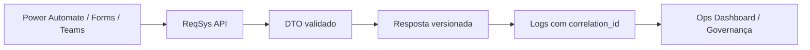

# OpenAPI / Swagger — ReqSys Runtime v0.3.0

> **Versão:** `0.3.0`  
> **Escopo:** documentação viva do contrato OpenAPI para prática GET/POST, Power Automate e runtime governado.

## Objetivo

Consolidar uma referência navegável e versionada do contrato HTTP do ReqSys para integração corporativa, automações e validação por agentes.

Este documento é **documentação viva**: deve evoluir junto com DTOs, endpoints, validações, coleções de teste e evidências operacionais.

## Artefato canônico

| Artefato | Caminho |
|---|---|
| OpenAPI JSON | `docs-site/assets/openapi/reqsys-runtime-openapi-v0.3.0.json` |
| Guia Power Automate GET/POST | `docs-site/api/power-automate-get-post.md` |
| Runtime API inicial | `docs-site/api/runtime.md` |

## Superfícies documentadas

| Método | Endpoint | Finalidade | Consumidor principal |
|---|---|---|---|
| `GET` | `/api/requisitos/{id}` | Consultar requisito mockado por identificador | Power Automate GET, testes, demonstração |
| `POST` | `/api/requisitos` | Receber/criar requisito mockado | Power Automate POST, Forms, Teams, automações |
| `GET` | `/api/runtime/health` | Verificar saúde operacional | CI, Ops Dashboard, monitoramento |
| `GET` | `/api/runtime/dashboard` | Obter sinais operacionais consolidados | Dashboard runtime |
| `GET` | `/api/runtime/analytics` | Obter evidências e analytics operacionais | Governança, BI, auditoria |

## Guardrails

- Não registrar dados sensíveis em claro.
- Exigir `correlation_id` nas respostas operacionais.
- Versionar contrato em `metadata.versao_contrato`.
- Manter OpenAPI, documentação, exemplos e testes alinhados.
- Separar erro de contrato de indisponibilidade operacional externa.

## Fluxo lógico

## Próximo incremento recomendado

Adicionar renderização visual do OpenAPI no portal de documentação com Swagger UI ou alternativa estática compatível com ambientes corporativos restritivos.
