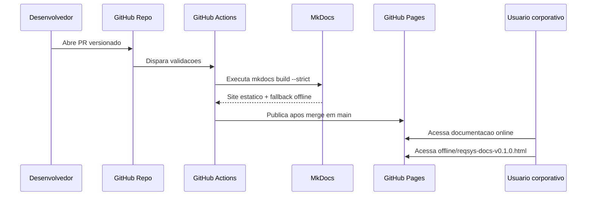
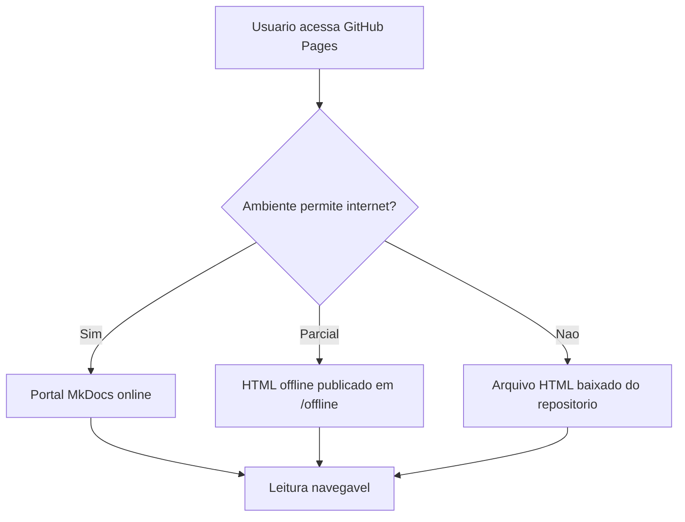

# Fluxo da Documentação Viva

> **Versão:** `0.2.0`

## Fluxo operacional

## Fluxo de compatibilidade offline

## Regras de manutenção

| Regra | Descrição |
|---|---|
| Versionar sempre | Toda mudança deve atualizar `VERSION.json` e `CHANGELOG.md` |
| Manter fallback | Todo release documental deve preservar HTML offline |
| Build strict | Nenhuma publicação deve passar sem `mkdocs build --strict` |
| Não quebrar link antigo | O caminho `offline/reqsys-docs-v0.1.0.html` deve continuar válido |
| Evidenciar | PR deve registrar o estado implementado, validado e pendente |

## Próxima evolução

O próximo incremento deve integrar OpenAPI/Swagger e artifacts JSON operacionais ao portal MkDocs.
