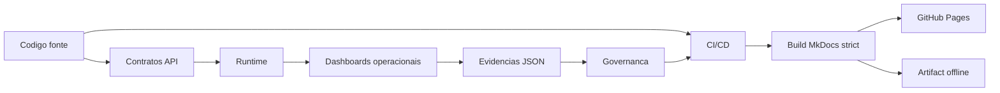

# Visão Geral — Arquitetura Viva

> **Versão:** `0.2.0`  
> **Data:** 28/06/2026  
> **Estado:** documentação viva inicial versionada.

## Objetivo

A Arquitetura Viva do ReqSys conecta documentação, contratos, runtime, CI/CD, evidências operacionais e governança em um fluxo auditável.

A documentação deixa de ser apenas estática e passa a funcionar como camada navegável de entendimento operacional do sistema.

## Mapa inicial



## Camadas

| Camada | Papel | Evidência |
|---|---|---|
| Código | Fonte de implementação | Repositório GitHub |
| Contratos | API, DTOs e payloads | Docs e OpenAPI futuro |
| Runtime | Execução pública e health checks | `/health` e `/api/runtime/*` |
| Observabilidade | Evidências, logs e analytics | Artifacts JSON |
| Documentação | Portal MkDocs e fallback offline | `docs-site/` e `offline/` |
| Governança | Versionamento, CI e rastreabilidade | PR, changelog e VERSION.json |

## Estado evidenciado

| Item | Estado |
|---|---:|
| Fonte MkDocs isolada | Verde |
| Build strict | Verde no PR anterior |
| Fallback offline | Corrigido neste incremento |
| Diagramas Mermaid | Inicial |
| OpenAPI integrado | Próximo incremento |
| Artifacts JSON renderizados | Próximo incremento |

## Decisão

A partir da versão `0.2.0`, a documentação oficial usa:

```text
docs-site/
```

O caminho `offline/` fica preservado dentro do site publicado para compatibilidade com ambientes corporativos e links diretos.
