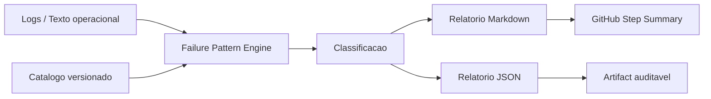

# Failure Pattern Engine — P0.1

Atualizado em: 2026-06-23  
Estado: incremento P0.1 implementado em modo classificacao  
Escopo: memoria operacional versionada para falhas recorrentes

## 1. Objetivo

Reduzir tempo de diagnostico, releitura manual de logs e recorrencia de falhas conhecidas no ReqSys.

O motor classifica evidencias textuais de falhas com base em um catalogo versionado, sem executar remediacao automatica.

## 2. Componentes

| Componente | Arquivo | Funcao |
|---|---|---|
| Catalogo de padroes | `config/failure-patterns.json` | Define erros conhecidos, severidade, categoria e acao recomendada |
| Classificador | `scripts/failure_pattern_engine.py` | Analisa texto/logs e gera relatorio JSON/Markdown |
| Workflow | `.github/workflows/failure-pattern-engine.yml` | Executa validacao e publica artifact |
| Documentacao | `docs/FAILURE_PATTERN_ENGINE_P01.md` | Rastreia decisao, limites e proximos passos |

## 3. Fluxo

## 4. Categorias iniciais

| Categoria | Exemplo | Severidade padrao |
|---|---|---|
| permissions | `Resource not accessible by integration` | alta |
| git_conflict | conflito de merge | alta |
| quota | quota/rate limit | media |
| artifact | artifact ausente | media |
| timeout | timeout/cancelamento | media |
| dependencies | falha npm/pnpm/yarn | media |
| quality_gate | ruff/lint/formato | media |
| test_failure | pytest/vitest/assertion | alta |

## 5. Saidas

O workflow gera:

- `failure-pattern-report.json`
- `failure-pattern-report.md`
- `sample.txt`

## 6. Politica de seguranca

### Pode fazer

- Classificar falhas conhecidas.
- Sugerir acao recomendada.
- Gerar artifact auditavel.
- Publicar resumo no GitHub Actions.

### Nao pode fazer

- Merge automatico.
- Push automatico em `main`.
- Deploy automatico.
- Rerun sem politica explicita.
- Remediacao automatica em producao.

### Nao deve fazer

- Ocultar falha real com rerun repetitivo.
- Classificar ausencia de match como ausencia de problema.
- Tratar severidade baixa como liberacao automatica.
- Misturar recomendacao com execucao.

## 7. Decisao operacional

Este P0.1 cria memoria operacional deterministica, mas ainda nao cria executor autonomo.

A proxima etapa segura e conectar este motor ao `ReqSys Operational Health`, enriquecendo o score com falhas classificadas.

## 8. Proximos incrementos

| Prioridade | Incremento | Resultado esperado |
|---|---|---|
| P0.2 | Integrar FPE ao Operational Health | Score operacional com causa raiz classificada |
| P0.3 | Operational Center HTML | Painel executivo navegavel com semaforo |
| P1 | Rerun policy engine | Rerun governado somente quando permitido |
| P1 | Remediation planner | Plano de correcao assistido, sem execucao automatica |

## 9. Criterio de aceite

- Catalogo JSON valido.
- Script Python compila sem dependencias externas.
- Workflow gera artifacts.
- Relatorio diferencia estado evidenciado e recomendacao.
- Nenhuma acao destrutiva e executada.
