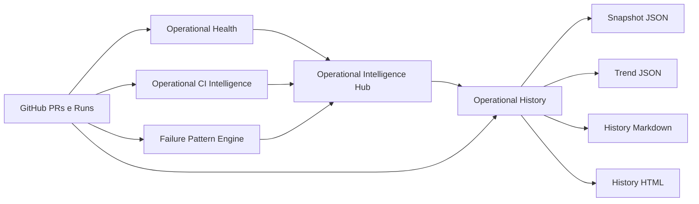

# Operational Center History — P0

Atualizado em: 2026-06-24  
Estado: incremento P0 implementado como historico via artifact e JSON.

## Objetivo

Adicionar historico operacional ao ReqSys Operational Center para acompanhar tendencia, reincidencia, MTTR estimado, duracao media e taxa de falha por workflow.

## Componentes

| Componente | Arquivo | Funcao |
|---|---|---|
| Engine historico | `scripts/operational_history.py` | Cria snapshot, historico e tendencia |
| Workflow | `.github/workflows/operational-center-history.yml` | Executa coleta, hub e historico |
| Diretorio historico | `data/operational-history/` | Local reservado para historico versionavel |
| Documentacao | `docs/OPERATIONAL_CENTER_HISTORY_P0.md` | Decisao, limites e evolucao |

## Fluxo



## Saidas

Artifact publicado:

```text
operational-center-history
```

Arquivos principais:

- `operational-history-snapshot.json`
- `operational-history.json`
- `operational-history-trend.json`
- `operational-history.md`
- `operational-history.html`

## Metricas P0

| Metrica | Descricao |
|---|---|
| `hub_score` | Score consolidado do hub |
| `hub_status` | Semaforo consolidado |
| `overall_failure_rate_percent` | Taxa geral de falha dos runs analisados |
| `workflow_failure_rates` | Taxa de falha por workflow |
| `avg_run_duration_minutes` | Duracao media estimada dos runs |
| `mttr_minutes` | Tempo medio estimado entre falha e proximo sucesso do mesmo workflow |
| `trend.direction` | Tendencia: melhorando, piorando ou estavel |
| `trend.delta_score` | Variacao do score no historico disponivel |

## Estado evidenciado versus alvo

| Dimensao | Estado P0 | Estado alvo |
|---|---|---|
| Persistencia | Artifact e JSON | Storage dedicado ou pagina estatica |
| Tendencia | Snapshots disponiveis | Serie historica continua |
| MTTR | Estimado por sequencia de runs | Calculado por incidente classificado |
| Dashboard | Markdown e HTML artifact | Painel principal integrado |
| Drill-down | Tabela por workflow | Drill-down por run, job e padrao |

## Politica operacional

Pode fazer:

- coletar runs recentes;
- gerar snapshot historico;
- calcular tendencia;
- calcular MTTR estimado;
- publicar artifact historico.

Nao faz:

- rerun automatico;
- merge automatico;
- deploy;
- alteracao de runtime produtivo.

## Proximo incremento recomendado

`Operational Center Published Artifact P0`:

- organizar HTML principal e historico em artifact unico;
- preparar publicacao futura opcional;
- manter zero-CDN e sem automacao destrutiva.
