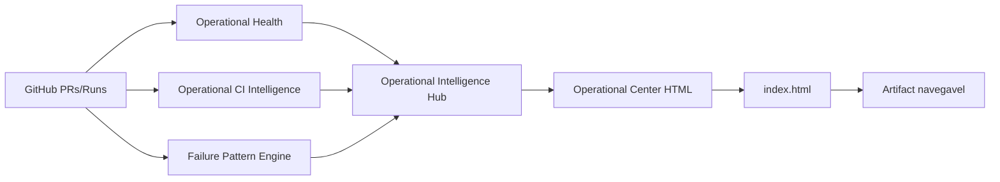

# Operational Center HTML — P0

Atualizado em: 2026-06-24  
Estado: incremento P0 implementado como painel HTML autocontido

## 1. Objetivo

Transformar o `Operational Intelligence Hub` em uma tela executiva navegável e auditável, sem depender de CDN, deploy externo ou runtime produtivo.

## 2. Componentes

| Componente | Arquivo | Função |
|---|---|---|
| Gerador HTML | `scripts/operational_center_html.py` | Converte o JSON consolidado em `index.html` responsivo |
| Workflow | `.github/workflows/operational-center-html.yml` | Executa coleta, engines, hub e geração do HTML |
| Documentação | `docs/OPERATIONAL_CENTER_HTML_P0.md` | Decisão, limites e próximos passos |

## 3. Fluxo



## 4. Saída

Artifact publicado:

```text
operational-center-html
```

Arquivo principal:

```text
artifacts/operational-center/index.html
```

## 5. Conteúdo do painel

O HTML inclui:

- status consolidado;
- score operacional;
- confiança do score;
- atualização UTC;
- camadas disponíveis e ausentes;
- tabela de camadas operacionais;
- componentes do score;
- próximas ações recomendadas;
- ações bloqueadas;
- limites operacionais;
- JSON consolidado embutido para rastreabilidade.

## 6. Requisitos não funcionais

| Requisito | Estado |
|---|---|
| Zero-CDN | Atendido |
| Responsivo | Atendido |
| HTML autocontido | Atendido |
| Sem deploy externo | Atendido |
| Sem alteração de runtime produtivo | Atendido |
| Artifact auditável | Atendido |

## 7. Política de segurança

### Pode fazer

- Gerar HTML a partir de evidência JSON.
- Publicar artifact navegável.
- Exibir dados operacionais consolidados.
- Exibir limites e ações bloqueadas.

### Não pode fazer

- Executar rerun automático.
- Fazer merge automático.
- Fazer deploy automático.
- Aplicar remediação.
- Usar `continue-on-error` para ocultar falha.

## 8. Estado evidenciado vs alvo

| Dimensão | Estado evidenciado P0 | Estado alvo |
|---|---|---|
| Painel | HTML artifact autocontido | Página operacional publicada com histórico |
| Visual | Cards, tabelas e semáforo | Drill-down, filtros e tendências |
| Dados | Snapshot atual | Histórico persistente |
| Navegação | Artifact baixável | Link público/dashboard interno |
| Automação | Geração agendada/manual | Integração contínua com incidentes |

## 9. Próximo incremento recomendado

`Operational Center History P0`:

- persistir snapshots de score;
- calcular tendência;
- MTTR;
- reincidência;
- taxa de falha por workflow;
- lead time operacional.
