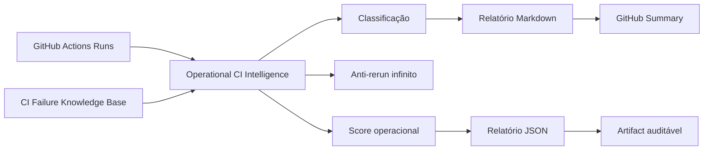

# Operational CI Intelligence — P0

Atualizado em: 2026-06-23  
Estado: incremento P0 implementado em modo analítico/governado

## 1. Objetivo

Transformar os dados do GitHub Actions em inteligência operacional auditável, reduzindo rerun cego, recorrência de falhas e diagnóstico manual.

## 2. Componentes entregues

| Componente | Arquivo | Função |
|---|---|---|
| Knowledge Base | `config/ci-failure-knowledge-base.json` | Catálogo operacional de falhas recorrentes, owner, severidade e política de rerun |
| Engine | `scripts/operational_ci_intelligence.py` | Classifica runs, calcula score e recomenda ações |
| Workflow | `.github/workflows/operational-ci-intelligence.yml` | Coleta runs recentes e publica relatório como artifact |
| Documentação | `docs/OPERATIONAL_CI_INTELLIGENCE_P0.md` | Decisão, limites e próximos incrementos |

## 3. Fluxo



## 4. Capacidades P0

- Classificação de falhas conhecidas por sintomas.
- Sugestão de owner operacional.
- Score operacional por severidade e recorrência.
- Anti-rerun infinito por workflow/SHA.
- Política explícita de rerun seguro.
- Relatório JSON e Markdown.
- Artifact auditável.

## 5. Política de segurança

### Pode fazer

- Coletar runs recentes.
- Classificar sintomas conhecidos.
- Recomendar owner e ação.
- Indicar se rerun é seguro ou bloqueado.
- Gerar artifacts.

### Não pode fazer

- Fazer rerun automaticamente.
- Fazer merge automático.
- Alterar produção.
- Aplicar correção automática.
- Mascarar falha com `continue-on-error`.

### Não deve fazer

- Declarar ausência de falha quando a base ainda não reconhecer o padrão.
- Usar rerun como primeira ação para falha de teste, segurança ou qualidade.
- Ignorar `failure` real.
- Tratar `cancelled` sempre como erro de código.

## 6. Anti-rerun infinito

Regra inicial:

```text
max_reruns_without_commit_change = 2
```

Se o mesmo workflow rodar repetidamente para o mesmo SHA acima do limite, o relatório recomenda bloqueio operacional até haver:

- mudança de commit; ou
- causa raiz documentada; ou
- decisão humana explícita.

## 7. Estado evidenciado vs alvo

| Dimensão | Estado evidenciado P0 | Estado alvo |
|---|---|---|
| Classificação | Heurística por sintomas | Histórico com tendência real |
| Rerun policy | Recomendação auditável | Gate integrado ao executor |
| Owner | Inferido por categoria | Owner por CODEOWNERS/área |
| Dashboard | Markdown/JSON artifact | UI operacional navegável |
| Remediação | Não executada | Advisor assistido, sem destrutividade |

## 8. Próximos incrementos

| Prioridade | Incremento | Resultado esperado |
|---|---|---|
| P0.1 | Integrar com Actions Deep Diagnostic | Classificar logs reais automaticamente |
| P0.2 | Histórico persistente por artifact/cache | Tendência, recorrência e MTTR |
| P1 | Operational Center HTML | Dashboard vivo navegável |
| P1 | Rerun Policy Gate | Bloquear rerun em loop sem evidência |
| P2 | Remediation Advisor | Sugestão de arquivo/linha/ação provável |

## 9. Critério de aceite

- Workflow manual executável.
- Knowledge base JSON válida.
- Engine Python sem dependências externas.
- Relatório Markdown publicado no summary.
- Artifact JSON/Markdown publicado.
- Nenhuma ação destrutiva executada.
