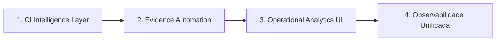

# Roadmap de Incrementos Operacionais

Atualizado em: 2026-06-27  
Estado: camada 2 (Evidence Automation) em evolução ativa

## Ordem recomendada



| # | Camada | Objetivo | Estado atual | Próximo entregável |
|---|---|---|---|---|
| 1 | **CI Intelligence Layer** | Classificar falhas, Pareto e histórico de instabilidade | Entregue (Pareto, KB+FPE, histórico) | Manutenção contínua |
| 2 | **Evidence Automation** | Evidência pós-workflow, snapshots, score de maturidade contínuo | P1 em evolução (hook + score dinâmico) | Integração coordenador + UI |
| 3 | **Operational Analytics UI** | Cards clicáveis, timeline viva, drill-down de incidentes | Dashboards HTML + `MonitoramentoOperacionalView` | SPA unificada consumindo artifacts + APIs |
| 4 | **Observabilidade unificada** | Tracing ponta a ponta, correlação visual | Event bus, correlation reports, runtime endpoints | Plano único com `correlation_id` visual |

---

## 1. CI Intelligence Layer

### Objetivo

Transformar runs do GitHub Actions em inteligência acionável: classificação automática, ranking Pareto de causas e histórico de instabilidade auditável.

### Componentes

| Componente | Caminho | Função |
|---|---|---|
| Knowledge Base | `config/ci-failure-knowledge-base.json` | Falhas recorrentes, owners, política de rerun |
| Failure Pattern Engine | `config/failure-patterns.json`, `scripts/failure_pattern_engine.py` | Classificação determinística por padrões |
| CI Intelligence lib | `scripts/ci_intelligence_lib.py` | Pareto, instabilidade, histórico compartilhado |
| Engine | `scripts/operational_ci_intelligence.py` | Relatório consolidado JSON/Markdown |
| Workflow | `.github/workflows/operational-ci-intelligence.yml` | Coleta runs e publica artifact |
| Histórico | `data/operational-ci-history/instability-history.json` | Snapshots versionados de instabilidade |

### Capacidades P1 (esta entrega)

- Classificação unificada KB + Failure Pattern Engine por run.
- Ranking Pareto de causas (impacto = frequência × severidade).
- Histórico de instabilidade com tendência (melhorando / estável / piorando).
- Anti-rerun infinito e score operacional (herdado do P0).

### Fora de escopo desta camada

- Detecção estatística de flaky tests.
- Rerun automático ou merge automático.
- UI navegável (camada 3).

### Critério de aceite

- Engine gera `pareto_failures` e `instability_history` no JSON.
- Workflow persiste histórico em artifact reutilizável.
- Testes unitários cobrem Pareto, classificação e tendência.

---

## 2. Evidence Automation

### Objetivo

Gerar evidência auditável automaticamente após cada workflow relevante, com snapshots de maturidade contínuos.

### Componentes (P1)

| Componente | Caminho | Função |
|---|---|---|
| Maturity signals | `scripts/ci_intelligence_lib.py` | `derive_maturity_signals()` mapeia CI/PR/coordenador → dimensões |
| Snapshot engine | `scripts/delivery_maturity_snapshot.py` | Score contínuo, histórico, fontes dinâmicas |
| Post-workflow hook | `.github/workflows/evidence-maturity-post-workflow.yml` | Dispara após CI / OCI / PR Evidence Gate |
| Histórico | `data/delivery-maturity-history/maturity-history.json` | Série temporal de maturidade |
| Schema | `docs/contracts/delivery-maturity-snapshot.schema.json` | Versão 1.1.0 com `continuous_score` e `maturity_history` |

### Capacidades P1 (esta entrega)

- Hook `workflow_run` pós-workflow com geração inline de CI Intelligence.
- Score de maturidade contínuo alimentado por CI + PR Evidence Gate.
- Histórico persistente com tendência (melhorando / estável / piorando).
- Artifact versionado por SHA: `delivery-maturity-snapshot-<head_sha>`.

### Base existente

- `pr-evidence-gate.yml`, `coordenador-status-consolidator.py`
- `docs/dashboard/operational-evidence-hub.html`
- `scripts/delivery_maturity_snapshot.py`
- Família Product Intelligence em `tools/product_intelligence/`

### Próximo entregável

- Hook pós-workflow que consolida artifact + score de maturidade.
- Snapshot versionado por PR/SHA com retenção governada.
- Integração com CI Intelligence Layer (Pareto alimenta priorização de evidência).

### Referências

- `docs/runbooks/pr-evidence-gate.md`
- `docs/product-intelligence/FINAL_EVIDENCE_INDEX_PLAN.md`

---

## 3. Operational Analytics UI

### Objetivo

Painel operacional navegável com cards clicáveis, timeline viva e drill-down de incidentes.

### Base existente

- `docs/ops-dashboard/index.html`, `docs/dashboard/operational-evidence-hub.html`
- `frontend/src/views/MonitoramentoOperacionalView.vue` (runtime ao vivo)
- `frontend/src/views/UserFinalShellView.vue` em `/analytics` (placeholder)

### Próximo entregável

- Consumir artifacts de CI Intelligence + Evidence Automation.
- Cards com drill-down para Pareto, histórico e incidentes.
- Timeline correlacionada PR → workflow → falha → evidência.

### Referências

- `docs/OPERATIONAL_CENTER_HTML_P0.md`
- `docs/architecture/adr/ADR-025-operational-actions-center.md`

---

## 4. Observabilidade unificada

### Objetivo

Tracing ponta a ponta com correlação visual entre PR, workflow, runtime e evidência.

### Base existente

- `scripts/observability_correlation_report.py`
- `unified-operational-event-bus.yml`
- `backend/app/core/runtime_analytics.py`
- `docs/observabilidade/OBSERVABILIDADE_PADRAO.md`

### Próximo entregável

- Plano único de correlação (`correlation_id` + `X-Request-ID`).
- Visualização de cadeia PR → CI → runtime → evidência.
- Integração com Analytics UI (camada 3).

### Referências

- `docs/operations/RUNTIME_OPERATIONAL_CORRELATION_TIMELINE.md`
- `docs/adr/ADR-0005-observabilidade-auditoria.md`

---

## Política transversal

| Pode | Não pode |
|---|---|
| Classificar, ranquear, recomendar | Merge, deploy ou rerun automático |
| Publicar artifacts auditáveis | Mascarar falhas com `continue-on-error` |
| Evoluir histórico por arquivo versionado | Declarar maturidade 100% sem evidência |

## Dependências entre camadas

```text
CI Intelligence (Pareto + histórico)
    ↓ alimenta priorização
Evidence Automation (snapshots + maturidade)
    ↓ alimenta dados
Operational Analytics UI (cards + timeline)
    ↓ consome correlação
Observabilidade unificada (tracing visual)
```
