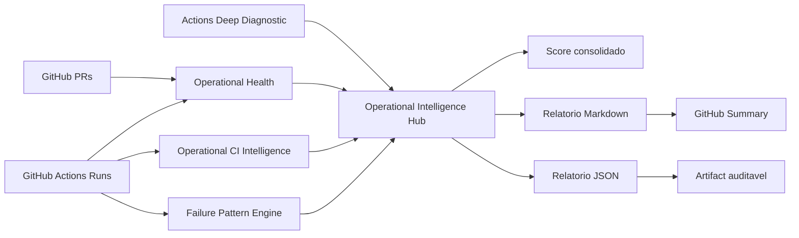

# Operational Intelligence Hub — P0

Atualizado em: 2026-06-24  
Estado: incremento P0 implementado em modo consolidador/governado

## 1. Objetivo

Integrar as camadas operacionais já criadas para produzir uma visão única de saúde, risco, causa provável e próximas ações.

Camadas integradas:

- `ReqSys Operational Health`
- `Operational CI Intelligence`
- `Failure Pattern Engine`
- `Actions Deep Diagnostic` quando houver artifact/entrada disponível

## 2. Componentes

| Componente | Arquivo | Função |
|---|---|---|
| Hub Python | `scripts/operational_intelligence_hub.py` | Consolida relatórios JSON e calcula score único |
| Workflow | `.github/workflows/operational-intelligence-hub.yml` | Executa health, CI intelligence, FPE e hub em sequência |
| Documentação | `docs/OPERATIONAL_INTELLIGENCE_HUB_P0.md` | Rastreia decisão, limites e evolução |

## 3. Fluxo



## 4. Saídas

O workflow publica um artifact único:

```text
operational-intelligence-hub
```

Com subpastas:

- `operational-health/`
- `operational-ci-intelligence/`
- `failure-pattern-engine/`
- `operational-intelligence-hub/`

Principais arquivos:

- `operational-intelligence-hub.json`
- `operational-intelligence-hub.md`
- `operational-health.json`
- `operational-ci-intelligence.json`
- `failure-pattern-report.json`

## 5. Score consolidado

Pesos iniciais:

| Camada | Peso |
|---|---:|
| Operational Health | 0.35 |
| Operational CI Intelligence | 0.35 |
| Failure Pattern Engine | 0.20 |
| Actions Deep Diagnostic | 0.10 |

A confiança do score depende da quantidade de camadas disponíveis:

| Camadas disponíveis | Confiança |
|---:|---|
| 1 | baixa |
| 2 | media |
| 3+ | alta |

## 6. Política de segurança

### Pode fazer

- Coletar dados de PRs e runs.
- Executar engines analíticos.
- Consolidar score.
- Publicar artifacts.
- Recomendar próximas ações.

### Não pode fazer

- Fazer rerun automático.
- Fazer merge automático.
- Aplicar correção automática.
- Fazer deploy.
- Ignorar falhas reais.

### Não deve fazer

- Tratar ausência de evidência como ausência de problema.
- Declarar maturidade alta com confiança baixa.
- Usar `continue-on-error` para esconder falhas.
- Executar remediação sem política e aprovação.

## 7. Estado evidenciado vs alvo

| Dimensão | Estado evidenciado P0 | Estado alvo |
|---|---|---|
| Integração | Camadas executadas e consolidadas por workflow | Dashboard vivo navegável |
| Score | Calculado por pesos iniciais | Score calibrado por histórico real |
| Causa raiz | Heurística por padrões | Classificação com histórico e recorrência |
| Diagnóstico profundo | Lido quando disponível | Acoplado automaticamente aos failures |
| Remediação | Não executada | Advisor assistido e governado |

## 8. Próximo incremento recomendado

`Operational Center HTML P0`

Objetivo:

- transformar o Markdown/JSON em painel HTML autocontido;
- mostrar cards de score, semáforo, falhas, owners, tendências e ações;
- manter zero-CDN;
- publicar artifact navegável.

## 9. Critério de aceite

- Workflow manual executável.
- Relatórios das camadas gerados.
- Hub consolidado publicado no summary.
- Artifact único publicado.
- Nenhuma ação destrutiva executada.
