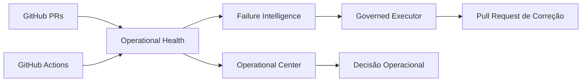

# ReqSys Runtime Platform — P0 Pareto

Atualizado em: 2026-06-23  
Estado: incremento inicial implementável, seguro e auditável  
Escopo: aceleração operacional sem perda de qualidade

## 1. Objetivo

Acelerar a evolução do ReqSys reduzindo retrabalho manual, falhas recorrentes e tempo de diagnóstico, sem relaxar qualidade, governança, rastreabilidade ou gates de segurança.

A estratégia adotada é Pareto: implementar primeiro os componentes que reduzem mais esforço operacional com menor risco de regressão.

## 2. Arquitetura recomendada

A próxima arquitetura operacional do ReqSys passa a ser tratada como uma plataforma de runtime governado.

## 3. Pilares

| Pilar | Função | Estado P0 |
|---|---|---|
| Operational Center | Visão única de PRs, workflows, riscos e tendência | Base documental + relatório automático |
| Governed Executor | Executar ações seguras com rastreabilidade | Desenhado, não automatizado em produção |
| Failure Intelligence | Classificar falhas conhecidas e recorrentes | Base inicial por padrões |
| Runtime Health | Medir estabilidade operacional | Workflow estatístico inicial |
| Release Governance | Impedir avanço sem evidência | Mantido como decisão governada |

## 4. Incremento P0 implementado

Este incremento introduz:

1. Workflow `ReqSys Operational Health`.
2. Script estatístico `scripts/reqsys_operational_health.py`.
3. Relatórios versionados como artifact:
   - `operational-health.json`
   - `operational-health.md`
4. Métricas iniciais:
   - total de PRs analisados
   - PRs abertos
   - PRs em draft
   - PRs mergeados
   - workflows analisados
   - workflows com sucesso
   - workflows com falha
   - taxa de sucesso de workflows
   - taxa de falha de workflows
   - score operacional consolidado
5. Classificação executiva:
   - VERDE
   - AMARELO
   - VERMELHO

## 5. Política operacional

### Pode ser feito

- Coletar estatísticas operacionais via GitHub API.
- Gerar relatório executivo automático.
- Usar artifacts para evidência.
- Classificar risco sem alterar produção.
- Evoluir para painel navegável.

### Não pode ser feito neste P0

- Fazer merge automático.
- Reexecutar workflow automaticamente sem política explícita.
- Alterar branch protegida diretamente.
- Aplicar remediação automática em produção.
- Declarar maturidade 100% sem evidência histórica.

### Não deve ser feito

- Criar automação auto-healing sem allowlist.
- Mascarar falhas por rerun indiscriminado.
- Tratar CI verde isolado como estabilidade consolidada.
- Misturar estado alvo com estado evidenciado.

## 6. Gates de qualidade

| Gate | Regra |
|---|---|
| Evidência | Todo status precisa vir de dado coletado |
| Segurança | Nenhuma ação destrutiva automática no P0 |
| Rastreabilidade | Todo relatório gera artifact |
| Governança | Estado alvo e estado evidenciado permanecem separados |
| Operação | Falha de coleta não deve quebrar produção |

## 7. Métrica de maturidade operacional

O score operacional inicial é calculado por combinação de:

- taxa de sucesso dos workflows recentes
- volume de falhas recentes
- PRs abertos
- PRs em draft
- presença de dados suficientes

O score é indicativo, não substitui análise técnica.

## 8. Próximos incrementos Pareto

| Prioridade | Incremento | Resultado esperado |
|---|---|---|
| P0.1 | Failure Pattern Engine versionado | Reduzir releitura manual de logs |
| P0.2 | Operational Center HTML navegável | Ver tudo em tela com semáforo |
| P0.3 | Policy Engine para rerun seguro | Preparar automação controlada |
| P1 | Governed Executor assistido | Abrir PRs de correção com trilha |
| P1 | Histórico de tendência | MTTR, lead time, flakiness e evolução |

## 9. Decisão arquitetural

Aceleração será buscada por redução de atrito operacional, não por aumento de complexidade arquitetural.

A regra principal permanece:

> Menor mudança correta, com evidência real, rastreabilidade e rollback conceitual claro.
