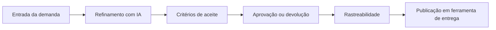

# ReqSys — Diretriz de UX para uso real

## Decisão

O ReqSys deve priorizar a jornada diária do usuário final antes de expor detalhes técnicos de infraestrutura, CI, runtime, ambientes ou governança.

A tela inicial passa a responder quatro perguntas:

1. O que preciso resolver hoje?
2. Quais demandas precisam de refinamento?
3. Quais requisitos estão prontos para aprovação ou execução?
4. Onde está a rastreabilidade da decisão e da entrega?

## Problema corrigido

A navegação e o dashboard estavam misturando informações de produto, engenharia, integração, runtime, CI/CD, segredos, arquitetura e governança.

Isso é útil para operação técnica, mas gera ruído para analistas, POs e usuários de negócio que precisam apenas cadastrar, refinar, aprovar e acompanhar requisitos.

## Regra de organização

### Deve aparecer primeiro

- Painel do dia
- Demandas e requisitos
- Fluxo de aprovação
- Rastreabilidade
- Qualidade IA
- Recomendações IA
- Indicadores executivos

### Deve ficar em áreas técnicas

- CI/CD
- runtime
- segredos
- monitoramento de ambiente
- arquitetura
- specs técnicas
- Codex
- integrações administrativas
- governança enterprise

## Jornada principal

## Critério de pronto para uso real

O ReqSys deve ser considerado pronto para operação diária quando:

- um usuário conseguir cadastrar uma demanda sem conhecer a arquitetura interna;
- o painel inicial mostrar pendências e próximos passos de forma objetiva;
- os dados técnicos não competirem com a jornada de negócio;
- cada requisito possuir origem, decisão, status, responsável, critério de aceite e evidência;
- a publicação para ferramenta externa for auditável;
- o dashboard executivo diferenciar item pendente, item em refinamento, item aprovado e item rastreável;
- a governança de CI/CD continuar existindo, mas sem poluir a experiência do usuário final.

## Próximos incrementos recomendados

1. Criar filtros persistentes em `/requisitos` para `recebido`, `em_analise`, `aprovado` e baixa qualidade.
2. Criar tela ou painel lateral de detalhe do requisito com origem, decisão, história, BDD e evidências.
3. Adicionar métrica real de requisito sem rastreabilidade.
4. Criar validação E2E da jornada: login → novo requisito → refinamento → aprovação → rastreabilidade.
5. Separar permissões entre analista, PO, admin, auditor e viewer.
