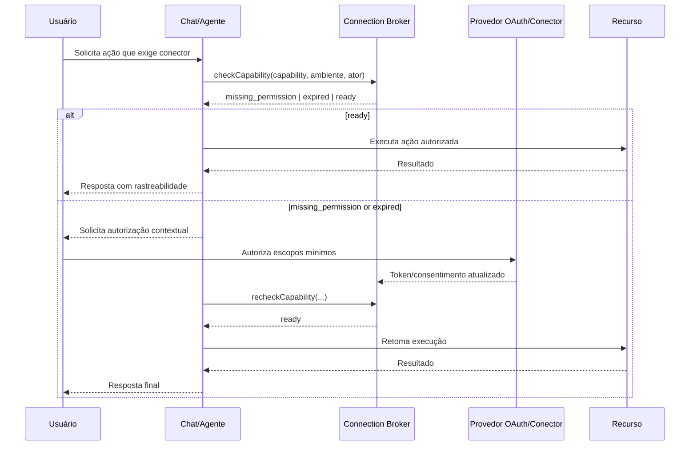

# ADR-020 — Connection Broker e Permission-on-Demand AI

**Status:** Proposto  
**Data:** 2026-06-20  
**Escopo:** ReqSys / GovBI / Hermes / integrações corporativas  
**Decisão:** Implementar um padrão transversal de `Connection Broker` com fluxo `Permission-on-Demand AI` para reduzir falhas operacionais causadas por conectores não autorizados, expirados ou sem escopo suficiente.

---

## 1. Contexto

Usuários esquecem de autorizar conectores antes de solicitar ações no chat, causando interrupções em fluxos como GitHub, Drive, Gmail, Calendar, Figma, Microsoft Graph, Dataverse e APIs corporativas.

O chat/agente não deve forçar consentimento, autoautorizar escopos ou contornar OAuth. A solução correta é detectar capacidades ausentes, solicitar autorização no momento necessário e retomar a execução com rastreabilidade.

---

## 2. Decisão

Adotar um componente lógico chamado `reqsys-connection-broker`, responsável por:

- registrar conectores disponíveis;
- declarar escopos mínimos por capability;
- verificar status de autenticação/autorização no início da sessão;
- detectar token expirado, escopo ausente ou conector indisponível;
- acionar pedido contextual de permissão;
- retomar o fluxo após autorização;
- registrar auditoria com `correlation_id`;
- impedir execução quando permissões mínimas não existirem.

---

## 3. Princípios obrigatórios

1. **Consentimento explícito:** nenhuma autorização automática sem ação humana.
2. **Menor privilégio:** solicitar apenas os escopos necessários para a ação.
3. **Fail closed:** sem permissão, a ação é bloqueada com mensagem objetiva.
4. **Rastreabilidade:** toda verificação deve registrar `correlation_id`, ator, conector, capability e decisão.
5. **Retomada segura:** após autorização, a execução continua somente se o estado da solicitação ainda for válido.
6. **Segurança de segredos:** tokens nunca devem ir para logs, prompts, analytics ou HTML estático.
7. **Ambientes segregados:** dev, homologação e produção devem ter registros de conectores separados.

---

## 4. Fluxo canônico

---

## 5. Modelo de capability

Cada capability deve conter `id`, `descricao`, `conector`, `ambientes`, `escopos_minimos`, `acoes_dependentes`, `criticidade`, `fallback`, `responsavel` e `ultima_validacao`.

---

## 6. Gates obrigatórios

Produção deve ser bloqueada quando ocorrer:

- conector crítico sem health-check válido;
- capability sem escopos mínimos mapeados;
- token expirado sem refresh seguro;
- uso de escopo amplo sem justificativa;
- ausência de auditoria com `correlation_id`;
- segredo/token exposto em log, HTML, prompt ou analytics;
- ação de escrita sem confirmação humana quando exigida.

---

## 7. Consequências

### Positivas

- Reduz interrupções operacionais por falta de autorização.
- Padroniza integrações entre agentes e conectores.
- Melhora governança, segurança e rastreabilidade.
- Permite dashboard de saúde dos conectores.

### Custos

- Exige cadastro e manutenção de capabilities.
- Aumenta a complexidade inicial de autenticação.
- Requer testes específicos por provedor e ambiente.

---

## 8. Próximos incrementos

1. Implementar registry executável em backend.
2. Criar endpoint `/connectors/health`.
3. Criar endpoint `/connectors/capabilities/check`.
4. Criar UI de status de conectores.
5. Integrar alertas no painel `/monitoramento-operacional`.
6. Adicionar testes unitários, contrato e E2E.
