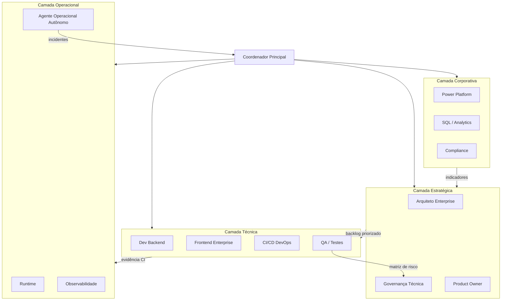
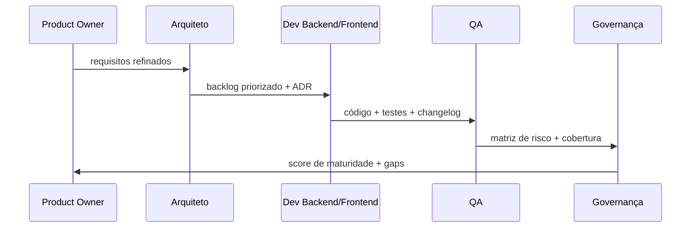

# Arquitetura Geral de Multiagentes — ReqSys Enterprise

**Código:** AI-GOV-IA-003  
**Data:** 2026-06-28  
**Status:** canônico  
**Relacionado:** [MULTIAGENT_STANDARD.md](MULTIAGENT_STANDARD.md), [AGENT_GOVERNANCE.md](AGENT_GOVERNANCE.md)

## Objetivo

Definir a arquitetura de colaboração entre agentes especializados no ecossistema ReqSys, com contratos claros, outputs estruturados, validação cruzada e rastreabilidade por `correlation_id`.

## Princípios

| Princípio | Descrição |
| --- | --- |
| 1 agente = 1 responsabilidade forte | Cada agente possui domínio exclusivo e output previsível |
| Outputs versionados | Toda saída segue schema versionado (`agent-output.schema.json`) |
| Contratos JSON/OpenAPI | Integração entre agentes via contratos validáveis |
| Validação automática entre agentes | Cross-validation antes de merge ou promoção |
| Execução paralela sem conflito | Agentes técnicos operam em branches/escopos isolados |
| Rastreabilidade | `correlation_id` obrigatório em toda operação relevante |
| Evidência operacional persistida | Artifacts versionados em `docs/evidencias/` e CI |

## Estratégia de orquestração



### Fluxo operacional canônico

```text
triagem → agente especializado → output estruturado → validação cruzada → CI → evidência → merge controlado
```

Automação real fica em **GitHub Actions + scripts + agentes por PR**; chats fixos são contexto, não runtime autônomo. Ver [coordenador-principal-menu-operacional.md](../../runbooks/coordenador-principal-menu-operacional.md).

## Catálogo de agentes

| # | Agente | Código | Camada | Prompt |
| --- | --- | --- | --- | --- |
| 1 | Arquiteto Enterprise | `agent-arquiteto` | Estratégica | [agents/01-arquiteto-enterprise.md](agents/01-arquiteto-enterprise.md) |
| 2 | Dev Backend | `agent-backend` | Técnica | [agents/02-dev-backend.md](agents/02-dev-backend.md) |
| 3 | Frontend Enterprise | `agent-frontend` | Técnica | [agents/03-frontend-enterprise.md](agents/03-frontend-enterprise.md) |
| 4 | CI/CD e DevOps | `agent-devops` | Técnica | [agents/04-cicd-devops.md](agents/04-cicd-devops.md) |
| 5 | QA / Testes | `agent-qa` | Técnica | [agents/05-qa-testes.md](agents/05-qa-testes.md) |
| 6 | Power Platform | `agent-power-platform` | Corporativa | [agents/06-power-platform.md](agents/06-power-platform.md) |
| 7 | SQL / Analytics | `agent-sql-analytics` | Corporativa | [agents/07-sql-analytics.md](agents/07-sql-analytics.md) |
| 8 | Governança Técnica | `agent-governanca` | Estratégica | [agents/08-governanca-tecnica.md](agents/08-governanca-tecnica.md) |
| 9 | Product Owner | `agent-product-owner` | Estratégica | [agents/09-product-owner.md](agents/09-product-owner.md) |
| 10 | Operacional Autônomo | `agent-operacional` | Operacional | [agents/10-operacional-autonomo.md](agents/10-operacional-autonomo.md) |

## Contrato de output padronizado

Todo agente deve produzir saída compatível com `docs/contracts/agent-output.schema.json`:

```json
{
  "schema_version": "1.0.0",
  "correlation_id": "uuid",
  "agent": "agent-backend",
  "generated_at": "2026-06-28T12:00:00Z",
  "contexto": {},
  "diagnostico": {},
  "riscos": [],
  "acoes_recomendadas": [],
  "quick_wins": [],
  "proximo_incremento": {},
  "nivel_confianca": 0.85
}
```

Exemplo completo: [`examples/agent-output/agent-output.example.json`](../../../examples/agent-output/agent-output.example.json).

### Campos obrigatórios

| Campo | Tipo | Descrição |
| --- | --- | --- |
| `schema_version` | string | Versão do contrato (`1.0.0`) |
| `correlation_id` | string | Rastreabilidade ponta a ponta |
| `agent` | string | Identificador canônico do agente |
| `generated_at` | datetime | Timestamp ISO 8601 |
| `contexto` | object | Contexto analisado pelo agente |
| `diagnostico` | object | Diagnóstico estruturado |
| `riscos` | array | Riscos identificados com severidade |
| `acoes_recomendadas` | array | Ações priorizadas |
| `quick_wins` | array | Melhorias de baixo esforço e alto impacto |
| `proximo_incremento` | object | Próximo passo natural |
| `nivel_confianca` | number | 0.0–1.0 |

## Regras de orquestração

### Paralelismo seguro

| Cenário | Agentes paralelos permitidos | Restrição |
| --- | --- | --- |
| Análise pré-implementação | Arquiteto + PO + Governança | Report-only; sem alteração de código |
| Implementação | Backend **ou** Frontend **ou** DevOps | Um agente técnico por branch/PR |
| Validação pós-implementação | QA + Governança | Após CI verde |
| Incidente runtime | Operacional Autônomo | Nunca ação destrutiva sem validação |

### Gates obrigatórios

1. **Agent Increment Gate** — antes de abrir branch/PR novo (`scripts/agent_increment_gate.py`)
2. **CI — ReqSys v2 Enterprise** — antes de merge
3. **Validação de contrato** — output do agente contra `agent-output.schema.json`
4. **Coordenador Status** — semáforo global antes de promover ambientes

### Integração com Coordenador Principal

| Semáforo | Condição | Ação dos agentes |
| --- | --- | --- |
| Verde | Orchestrator + Health Validator verdes | Continuar incremento planejado |
| Amarelo | Pendências ou `OPS-PENDING-*` | Report-only; validar antes de merge |
| Vermelho | `OPS-GAP-*` crítico ou CI falho | Bloquear; agente Operacional propõe remediação |

## Validação cruzada



Cada handoff deve incluir `correlation_id` propagado desde a triagem inicial.

## Benefícios operacionais

- **Orquestração** — outputs estruturados permitem automação de dashboards
- **Auditoria** — toda decisão rastreável por `correlation_id`
- **Analytics** — agregação de `nivel_confianca` e riscos por domínio
- **Memória operacional** — artifacts persistidos alimentam arquitetura viva
- **Validação cruzada** — agentes validam outputs uns dos outros antes de merge
- **Dashboards automáticos** — integração com `docs/ops-dashboard/` e Product Intelligence

## Referências

- [AGENT_GOVERNANCE.md](AGENT_GOVERNANCE.md) — regras de governança
- [MULTIAGENT_STANDARD.md](MULTIAGENT_STANDARD.md) — resumo executivo
- [coordenador-principal-menu-operacional.md](../../runbooks/coordenador-principal-menu-operacional.md) — menu operacional
- [agent-output.schema.json](../../contracts/agent-output.schema.json) — contrato JSON
- [living-architecture-index.json](../../padrao-ouro/living-architecture-index.json) — índice machine-readable
- [AGENTS.md](../../../AGENTS.md) — guia operacional para agentes no repositório
