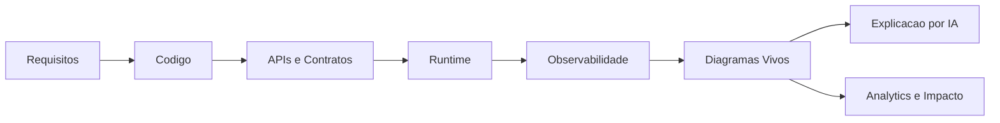
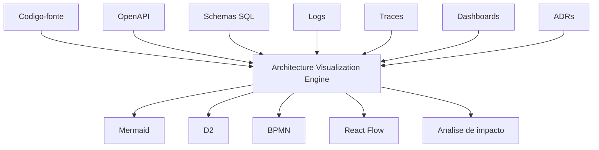

# Arquitetura Viva — Diagramas e Fluxos Navegáveis

## Objetivo

Definir a referência canônica para geração, manutenção e navegação de diagramas e fluxos no ReqSys e no ecossistema corporativo associado.

A proposta é transformar documentação arquitetural, técnica, funcional e analítica em artefatos vivos, rastreáveis, auditáveis e explicáveis por IA.

## Princípio Central

Diagramas e fluxos devem ser tratados como produtos derivados de fontes confiáveis, não como imagens soltas ou documentação isolada.



## Requisitos Canônicos

| Requisito | Descrição |
|---|---|
| Vivo | Deve refletir o estado atual ou informar claramente a versão/fonte usada. |
| Automático | Deve ser gerado a partir de código, metadados, runtime, contratos ou schemas. |
| Navegável | Deve permitir drill-down entre visão executiva, funcional, técnica e runtime. |
| Integrado ao runtime | Deve usar logs, traces, métricas e correlation_id quando disponíveis. |
| Integrado ao código | Deve mapear rotas, serviços, módulos, camadas, dependências e contratos. |
| Integrado ao analytics | Deve conectar dashboard, indicador, regra, origem de dados, API e SQL. |
| Versionado | Deve ter versionamento e histórico de alteração. |
| Auditável | Deve registrar origem, hash, autor/agente, data e ambiente. |
| Explicável por IA | Deve permitir explicação de fluxo, impacto, risco, dependência e lacunas. |

## Níveis de Visualização

| Nível | Público | Objetivo |
|---|---|---|
| N1 — Executivo | Gestão, PO, stakeholders | Visão de capacidades, fluxos macro, riscos e impacto. |
| N2 — Funcional | Analistas, negócio, QA | Fluxos de processo, regras, jornada e critérios. |
| N3 — Técnico | Devs, arquitetura, segurança | Componentes, APIs, banco, dependências e integrações. |
| N4 — Runtime | SRE, DevOps, suporte | Execução real, traces, logs, incidentes e performance. |
| N5 — Analytics | BI, dados, governança | Linhagem, métricas, origem, cálculo, datasets e dashboards. |

## Módulo Proposto

```text
src/platform/architecture-visualization/
  README.md
  contracts/
  generators/
  parsers/
  renderers/
  runtime/
  lineage/
  ai/
```

## Fontes de Entrada



## Casos de Uso Prioritários

### 1. Análise de Impacto

Ao selecionar uma tela, API, tabela, procedure ou indicador, o sistema deve exibir dependências e impactos.

Exemplo:

```text
Dashboard > Indicador > Dataset > API > Service > Repository > SQL > Regra de Negocio
```

### 2. Fluxo de Requisito até Produção

```text
Requisito > Analise IA > Backlog > Branch > PR > CI > Homologacao > Producao > Monitoramento
```

### 3. Linhagem Analítica

```text
Card do Dashboard > Metricas > Regra de Calculo > Fonte SQL > API > Owner > SLA
```

### 4. Runtime Traceável

```text
Requisicao HTTP > correlation_id > API > Service > Banco > Evento > Log > Metrica
```

## Segurança e LGPD

Antes de publicar qualquer diagrama, aplicar:

- mascaramento de PII;
- remoção de secrets;
- classificação de informação;
- controle por perfil/RBAC;
- rastreabilidade da fonte;
- validação contra exposição de dados sensíveis.

## Padrão de Metadados

Todo diagrama deve possuir metadados mínimos:

```json
{
  "id": "diag-reqsys-runtime-001",
  "titulo": "Fluxo Runtime de Requisito",
  "versao": "1.0.0",
  "ambiente": "dev|homologacao|producao",
  "fonte": ["codigo", "openapi", "traces"],
  "gerado_em": "2026-06-20T00:00:00-03:00",
  "gerado_por": "architecture-visualization-engine",
  "correlation_id": null,
  "hash": "sha256:<valor>",
  "confiabilidade": "alta|media|baixa"
}
```

## Roadmap Incremental

| Incremento | Entrega |
|---|---|
| I1 | ADR, documentação e contratos base. |
| I2 | Gerador Mermaid manual/semiautomático. |
| I3 | Parser de rotas/API e estrutura de módulos. |
| I4 | UI navegável com React Flow. |
| I5 | Linhagem analytics e SQL. |
| I6 | Integração OpenTelemetry/correlation_id. |
| I7 | Explicação por IA com fontes e confiabilidade. |
| I8 | Gates CI/CD para diagramas e exposição de dados. |

## Definição de Pronto

- Documentação versionada.
- ADR aceito.
- Estrutura técnica criada.
- Testes mínimos previstos.
- Gates de segurança documentados.
- Estratégia de evolução incremental clara.
- PR mantido em draft até CI verde.
