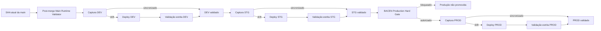

# Fluxo de promoção automática Fly

```mermaid
flowchart LR
  M[SHA atual da main] --> V[Post-merge Main Runtime Validator]
  V --> CDEV[Captura DEV]
  CDEV -->|sincronizado| DOK[DEV validado]
  CDEV -->|drift| DDEP[Deploy DEV]
  DDEP --> DVER[Validação estrita DEV]
  DVER --> DOK
  DOK --> CSTG[Captura STG]
  CSTG -->|sincronizado| SOK[STG validado]
  CSTG -->|drift| SDEP[Deploy STG]
  SDEP --> SVER[Validação estrita STG]
  SVER --> SOK
  SOK --> BACEN[BACEN Production Hard Gate]
  BACEN -->|bloqueado| STOP[Produção não promovida]
  BACEN -->|autorizado| CPROD[Captura PROD]
  CPROD -->|sincronizado| POK[PROD validado]
  CPROD -->|drift| PDEP[Deploy PROD]
  PDEP --> PVER[Validação estrita PROD]
  PVER --> POK
```

Cada seta de promoção exige o mesmo SHA imutável e artifacts íntegros. A `main` avançar invalida a execução em curso antes do deploy.
