# Fluxo legado de promoção Fly — manual-only

```mermaid
flowchart LR
  OP[workflow_dispatch explícito] --> M[SHA atual da main]
  M --> DEV[Validar DEV no PC24x7 pelo locator assinado]
  DEV -->|verde| CSTG[Capturar HML Fly legado]
  CSTG -->|sincronizado| SOK[HML validado]
  CSTG -->|drift| SDEP[Deploy HML Fly]
  SDEP --> SVER[Validação estrita HML]
  SVER --> SOK
  SOK --> BACEN[BACEN Production Hard Gate]
  BACEN -->|bloqueado| STOP[Produção não promovida]
  BACEN -->|autorizado| CPROD[Capturar PROD Fly legado]
  CPROD -->|sincronizado| POK[PROD validado]
  CPROD -->|drift| PDEP[Deploy PROD Fly]
  PDEP --> PVER[Validação estrita PROD]
  PVER --> POK
```

Não existe promoção Fly automática por `schedule` ou `workflow_run`. Fly não é permitido em DEV. O DEV canônico é PC24x7 e deve estar verde no mesmo SHA antes de qualquer avaliação manual de HML/PROD.

A `main` avançar invalida a solicitação antes de qualquer promoção. Produção continua sem bypass e sujeita ao BACEN Production Hard Gate.
