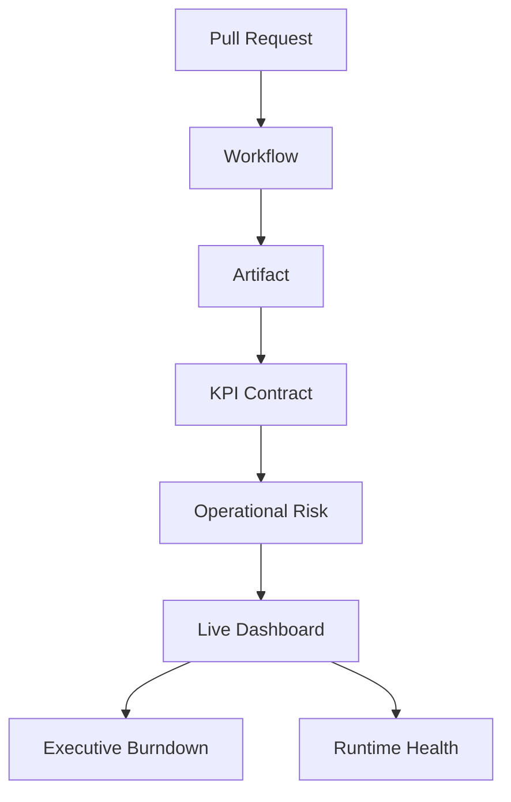

# Runtime Correlation Graph Navegável

## Objetivo

Criar a fundação de um grafo navegável que relacione workflow, artifact, risco, PR e runtime no ReqSys.

## Nós do grafo

| Nó | Tipo | Link lógico |
|---|---|---|
| GitHub Workflow | workflow | Actions run |
| Artifact de evidência | artifact | workflow artifact |
| PR | change | pull request |
| Risco operacional | risk | runtime risk scoring |
| Runtime Health | runtime | `/api/runtime/health` |
| Dashboard vivo | dashboard | `docs/dashboard/live-operational-dashboard.html` |
| Burndown executivo | governance | `docs/runbooks/operational-burndown-executive.md` |

## Relações

## Contrato mínimo de relacionamento

Cada relacionamento deve possuir:

- `from`;
- `to`;
- `relationship`;
- `source`;
- `href` quando navegável;
- `risk_level` quando aplicável;
- `correlation_id` quando disponível.

## Drill-down esperado

| Origem | Destino | Objetivo |
|---|---|---|
| PR | Workflow | Verificar CI do incremento |
| Workflow | Artifact | Validar evidência gerada |
| Artifact | KPI | Interpretar indicador |
| KPI | Risk | Classificar impacto |
| Risk | Dashboard | Exibir síntese executiva |
| Dashboard | Runtime | Validar estado operacional |

## Métricas de maturidade

| Dimensão | Atual | Alvo |
|---|---:|---:|
| Relações documentadas | 80% | 95% |
| Links navegáveis | 70% | 95% |
| Integração com artifacts | 75% | 95% |
| Correlação runtime | 78% | 95% |
| Drill-down executivo | 80% | 95% |

## Próximas evoluções

1. Gerar JSON do grafo automaticamente.
2. Renderizar grafo no dashboard HTML.
3. Associar cada nó a artifacts reais de workflow.
4. Integrar `correlation_id` fim-a-fim.
