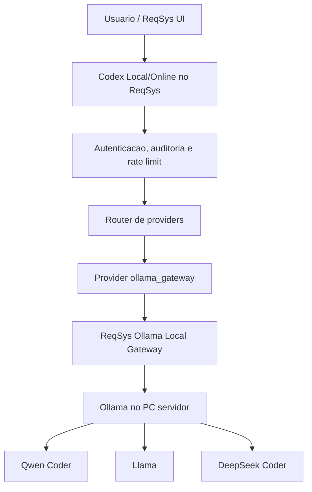

# Decisão — Codex Local/Online vs ReqSys Ollama Local Gateway

Data: 2026-06-22  
Status: aprovado para implementação incremental  
Issue: #95

## Decisão

Manter o **Codex Local/Online no ReqSys** como produto principal/canônico.

Manter o **ReqSys Ollama Local Gateway** somente como componente independente de infraestrutura, com papel de **provider local governado de IA**.

## Justificativa

O gateway não substitui o Codex Local/Online porque ele não entrega, sozinho, a experiência completa de engenharia dentro do ReqSys.

O Codex Local/Online concentra:

- UI operacional no ReqSys;
- autenticação e autorização do usuário;
- auditoria unificada;
- integração com backlog, issues, PRs e CI/CD;
- rastreabilidade com `correlation_id`;
- dashboards e drill-down;
- operação governada por ambiente.

O gateway concentra:

- conexão com Ollama no PC/servidor dedicado;
- roteamento local de modelos;
- isolamento da porta nativa `11434`;
- API interna para consumo pelo ReqSys;
- evolução independente dos modelos locais.

## Matriz de equivalência

| Capacidade | Gateway Ollama | Codex Local/Online ReqSys | Decisão |
|---|---:|---:|---|
| Servir modelos locais Ollama | Sim | Consome | Gateway |
| Proteger acesso ao Ollama nativo | Sim | Exige | Gateway |
| Roteamento local por tarefa | Sim | Orquestra | Ambos |
| UI operacional | Não | Sim | ReqSys |
| Auditoria corporativa | Parcial/local | Sim | ReqSys |
| RAG do repositório | Parcial/local | Sim/central | ReqSys |
| GitHub branch/PR/CI | Não | Sim | ReqSys |
| Executor governado | Não nesta fase | Sim como meta | ReqSys |
| Dashboard/drill-down | Não | Sim | ReqSys |
| Produto final para usuário | Não | Sim | ReqSys |

## Arquitetura alvo



## Regra operacional

- Não duplicar funcionalidades do Codex dentro do gateway.
- Não acoplar o ReqSys ao binário/processo do Ollama.
- Não expor `http://<host>:11434` diretamente para usuários, internet ou frontend.
- O ReqSys deve consumir o gateway por API autenticada.
- O gateway pode ser publicado em repositório independente quando o repo existir.
- Até lá, a integração e a decisão ficam rastreadas no ReqSys principal.

## Configuração recomendada

```env
CODEX_LOCAL_PROVIDER=ollama_gateway
CODEX_OLLAMA_GATEWAY_URL=http://<ip-do-pc-servidor>:8008
CODEX_OLLAMA_GATEWAY_API_KEY=<secret-em-cofre>
CODEX_OLLAMA_GATEWAY_MODEL=qwen2.5-coder:7b
```

## Critérios de aceite

- Provider `ollama_gateway` disponível no endpoint `/v1/codex/analyze`.
- Status operacional lista `ollama_gateway` como provider suportado.
- Teste automatizado valida contrato HTTP do gateway sem chamar rede real.
- Documentação deixa claro que o Codex Local/Online é o produto canônico.
- Issue #95 permanece como rastreabilidade de evolução.
