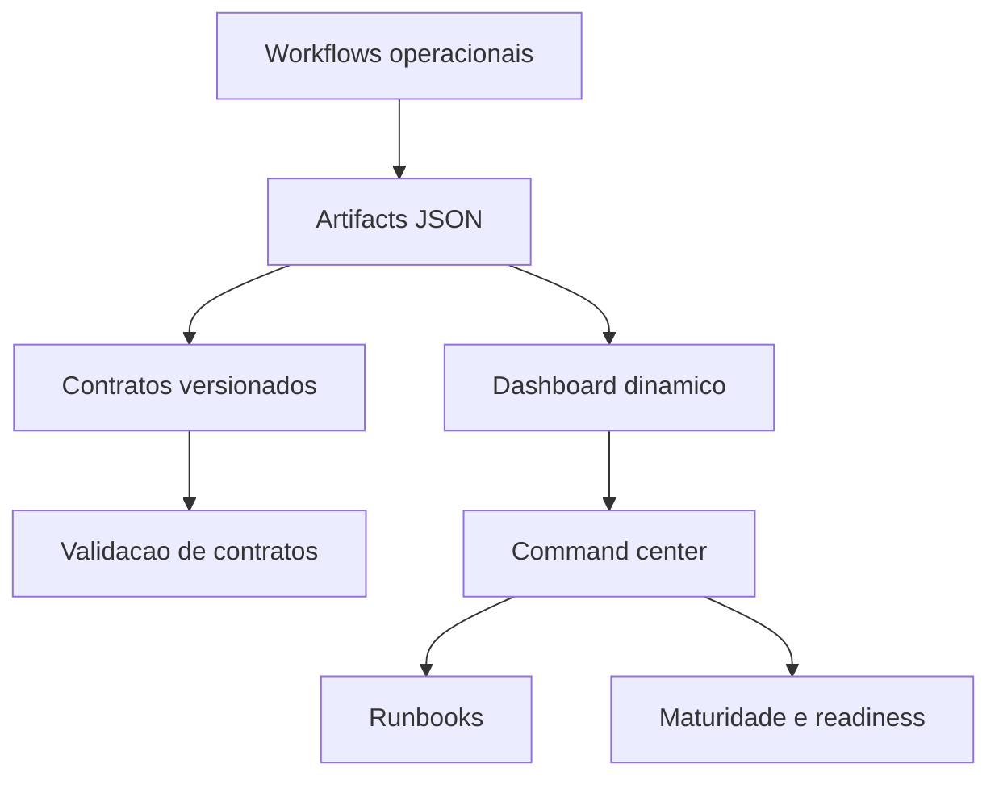

# Command Center Navigation Map — ReqSys

## Objetivo

Registrar o mapa navegavel entre dashboard, artifacts, workflows, contratos e runbooks do command center operacional.

## Fluxo principal

## Relacionamentos

| Origem | Destino | Tipo |
|---|---|---|
| CI Lead Time Analytics | Dynamic Dashboard | Consumo KPI |
| Operational History Snapshot | Dynamic Dashboard | Baseline historico |
| Runtime Predictive Analytics | Dynamic Dashboard | Risco preditivo |
| Operational Maturity Score | Dynamic Dashboard | Score executivo |
| Artifact Discovery Index | Dynamic Dashboard | Catalogo operacional |
| Release Readiness | Dynamic Dashboard | Prontidao de release |
| Contracts | Validation Workflows | Validacao |
| Dashboard | Runbooks | Drill-down documental |

## Indicadores de maturidade

| Indicador | Atual | Alvo |
|---|---:|---:|
| Navegacao artifact to dashboard | 94% | 98% |
| Navegacao dashboard to runbook | 90% | 98% |
| Cobertura de contratos | 98,5% | 99% |
| Readiness do command center | 95% | 98% |

## Regras

- Links e mapas devem refletir evidencias existentes.
- Estado alvo nao deve ser declarado como estado atual sem artifact real.
- Workflows report-only geram evidencia, nao substituem gates obrigatorios.
- Novos artifacts devem ser adicionados ao mapa na mesma rodada ou na rodada seguinte.
