# Diagrama de Dependências — ReqSys v2 Enterprise e Projetos do Workspace

> Gerado em: 2026-05-xx  
> Versão do ReqSys: 2.3.0

---

## Diagrama principal

```mermaid
flowchart TD
    subgraph INFRA["🏗️ Infraestrutura / Serviços Externos"]
        direction LR
        SQLite[("SQLite\nautocriado no start")]
        SQLServer[("SQL Server\nprod / port 1433")]
        RedmineAPI(["Redmine API\nhttps://seu-redmine.com"])
        GitHubAPI(["GitHub API\napi.github.com"])
        SSRSServer(["SSRS Server\n:8082/ReportServer"])
    end

    subgraph REQSYS["📦 ReqSys v2 Enterprise — v2.3.0"]
        direction TB
        RBK["①  Backend\nFastAPI 0.115\n:8210\n.venv\\Scripts\\python -m uvicorn app.main:app"]
        RFE["②  Frontend\nVue3 + Vuetify + Pinia\n:5173 / :5193\nnpm run dev"]
    end

    subgraph AIMETRICS["📊 AI Metrics — v1.1.0"]
        direction TB
        AMB["③  Backend\nFastAPI\n:8000\nuvicorn app.main:app"]
        AMF["④  Frontend\nVue3 + Vuetify\n:5173\nnpm run dev"]
    end

    subgraph TEAMSOUTBOX["📨 Teams Outbox v2 — v2.0.0"]
        direction TB
        TOB["⑤  Backend\nFastAPI\ndocker compose up"]
        TOF["⑥  Frontend\nVue3 + Vuetify\ndocker compose up"]
    end

    subgraph CLI["🔧 CLIs / Utilitários"]
        Pipeline["Pipeline Redmine\npython executar_pipeline_redmine_real.py\n--base-url --api-key --project-id"]
        Publicador["GitHub Publicador\npython github_publicador.py\n--pasta-base --owner GITHUB_TOKEN"]
        Tracker["Tracker Scraper\npython tracker.py\nbooks.toscrape.com → CSV"]
    end

    SQLite -->|"DATABASE_URL=sqlite:///./reqsys.db\n① sobe junto"| RBK
    SQLite -->|"DATABASE_URL=sqlite:///\n③ sobe junto"| AMB
    SQLServer -->|"pyodbc connection string\n(prod)"| RBK
    SQLServer -->|"pyodbc connection string\n(prod)"| TOB

    RBK -->|"VITE_API_URL=/api  ②"| RFE
    AMB -->|"VITE_API_URL=http://localhost:8000  ④"| AMF
    TOB -->|"docker-compose  ⑥"| TOF

    RBK -->|"REDMINE_URL + REDMINE_API_KEY\nPOST /v1/backlog/publicar-redmine/{id}"| RedmineAPI
    RBK -->|"ENABLE_GITHUB_REDMINE_IMPORT=true\nPOST /v1/integracoes/github/issues"| GitHubAPI
    RBK -->|"SSRS_BASE_URL\nGET /v1/relatorios/ssrs"| SSRSServer

    Pipeline -->|"--base-url --api-key\nimporta CSV → issues"| RedmineAPI
    Publicador -->|"GITHUB_TOKEN\ncria repos + push"| GitHubAPI

    RBK -. "ReqSys usa mesmo Redmine\nque Pipeline alimenta" .-> Pipeline
    RBK -. "ReqSys usa mesmo GitHub\nque Publicador gerencia" .-> Publicador

    style INFRA fill:#f0f4ff,stroke:#3b82f6,color:#1e3a8a
    style REQSYS fill:#f0fdf4,stroke:#16a34a,color:#14532d
    style AIMETRICS fill:#fefce8,stroke:#ca8a04,color:#713f12
    style TEAMSOUTBOX fill:#fff1f2,stroke:#e11d48,color:#881337
    style CLI fill:#f5f3ff,stroke:#7c3aed,color:#3b0764
    style RBK fill:#bbf7d0,stroke:#16a34a
    style RFE fill:#dcfce7,stroke:#16a34a
    style AMB fill:#fef9c3,stroke:#ca8a04
    style AMF fill:#fefce8,stroke:#ca8a04
    style TOB fill:#fecdd3,stroke:#e11d48
    style TOF fill:#ffe4e6,stroke:#e11d48
    style SQLite fill:#dbeafe,stroke:#3b82f6
    style SQLServer fill:#bfdbfe,stroke:#3b82f6
    style RedmineAPI fill:#e9d5ff,stroke:#7c3aed
    style GitHubAPI fill:#e9d5ff,stroke:#7c3aed
    style SSRSServer fill:#e9d5ff,stroke:#7c3aed
    style Pipeline fill:#ede9fe,stroke:#7c3aed
    style Publicador fill:#ede9fe,stroke:#7c3aed
    style Tracker fill:#ede9fe,stroke:#7c3aed
```

---

## Ordem de inicialização recomendada

| #   | Serviço                 | Comando                                                    | Pré-requisito         |
| --- | ----------------------- | ---------------------------------------------------------- | --------------------- |
| 1   | SQL Server (prod)       | Docker / serviço Windows                                   | —                     |
| 2   | ReqSys Backend          | `.venv\Scripts\python -m uvicorn app.main:app --port 8210` | BD disponível         |
| 3   | ReqSys Frontend         | `npm run dev` (pasta `frontend/`)                          | Backend `:8210`       |
| 4   | AI Metrics Backend      | `uvicorn app.main:app --port 8000`                         | — (SQLite autocriado) |
| 5   | AI Metrics Frontend     | `npm run dev`                                              | Backend `:8000`       |
| 6   | Teams Outbox (completo) | `docker compose up`                                        | SQL Server            |

---

## Mapa de rotas frontend → endpoints backend (ReqSys)

| Rota Frontend      | View                  | Permissão RBAC         | Endpoints chamados                                                                                                                                                                |
| ------------------ | --------------------- | ---------------------- | --------------------------------------------------------------------------------------------------------------------------------------------------------------------------------- |
| `/login`           | `LoginView`           | pública                | `POST /v1/auth/login`                                                                                                                                                             |
| `/`                | `DashboardView`       | `dashboard:read`       | `GET /v1/dashboard/requisitos` · `GET /v1/dashboard/info`                                                                                                                         |
| `/requisitos`      | `RequisitosView`      | `requisitos:write`     | `GET /v1/requisitos` · `POST /v1/requisitos`                                                                                                                                      |
| `/rastreabilidade` | `RastreabilidadeView` | `rastreabilidade:read` | ⚠️ dados estáticos/demo — sem chamada real                                                                                                                                        |
| `/auditoria`       | `AuditoriaView`       | `auditoria:read`       | ⚠️ dados estáticos/demo — sem chamada real                                                                                                                                        |
| `/pipeline`        | `PipelineView`        | `requisitos:write`     | `POST /v1/solicitacoes` · `POST /v1/requisitos/validar` · `POST /v1/requisitos/estruturar/{id}` · `POST /v1/backlog/publicar-redmine/{id}` · `POST /v1/integracoes/github/issues` |
| `/relatorios`      | `RelatoriosView`      | `relatorios:read`      | `GET /v1/relatorios/ssrs` · `GET /v1/relatorios/ssrs/health` · `GET /v1/relatorios/ssrs/status` · `GET /v1/relatorios/ssrs/{nome}/pdf`                                            |
| `/segredos-status` | `SegredosStatusView`  | `dashboard:read`       | `GET /v1/sistema/segredos-status`                                                                                                                                                 |

---

## Stores e Services (frontend)

### `src/stores/`

| Store                | Arquivo         | Responsabilidade                           |
| -------------------- | --------------- | ------------------------------------------ |
| `useAuthStore`       | `auth.js`       | JWT, login, logout, RBAC (`pode(recurso)`) |
| `useRequisitosStore` | `requisitos.js` | CRUD requisitos, métricas dashboard        |

### `src/services/`

| Service             | Arquivo         | Endpoints encapsulados                                             |
| ------------------- | --------------- | ------------------------------------------------------------------ |
| `api` (Axios)       | `api.js`        | Instância base — `VITE_API_URL` + interceptor JWT + Correlation-ID |
| `relatoriosService` | `relatorios.js` | Todos os endpoints `/v1/relatorios/ssrs/*`                         |

---

## Observações e inconsistências encontradas

| Item                                                                    | Situação                                                                                   |
| ----------------------------------------------------------------------- | ------------------------------------------------------------------------------------------ |
| `AuditoriaView` e `RastreabilidadeView`                                 | Usam dados **estáticos hardcoded** — não há integração real com o backend ainda            |
| `/v1/solicitacoes`                                                      | Endpoint do Pipeline não estava mapeado no diagrama inicial                                |
| `GET /v1/dashboard/requisitos` e `GET /v1/dashboard/info`               | O diagrama mostrava apenas `/v1/dashboard` — na realidade são duas rotas distintas         |
| `GET /v1/relatorios/ssrs/status` e `GET /v1/relatorios/ssrs/{nome}/pdf` | Sub-rotas de relatórios não estavam no diagrama — agora mapeadas                           |
| Correlation-ID                                                          | Implementado no interceptor `api.js` com fallback para contextos sem `crypto.randomUUID()` |
| Rota `/segredos-status`                                                 | Usa `GET /v1/sistema/segredos-status` (módulo `sistema`, não um módulo dedicado)           |
