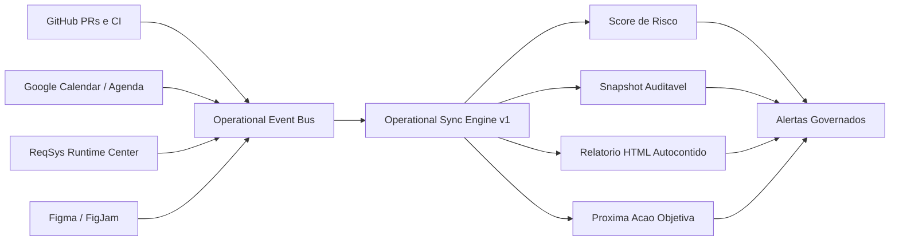

# Operational Sync Engine v1 — Retorno Visual

## Critérios visuais obrigatórios

- Deve existir retorno navegável no repositório.
- Deve existir fallback `.html` autocontido.
- Deve existir diagrama versionado mesmo quando Figma/FigJam não estiver disponível.
- Deve existir referência explícita no PR.
