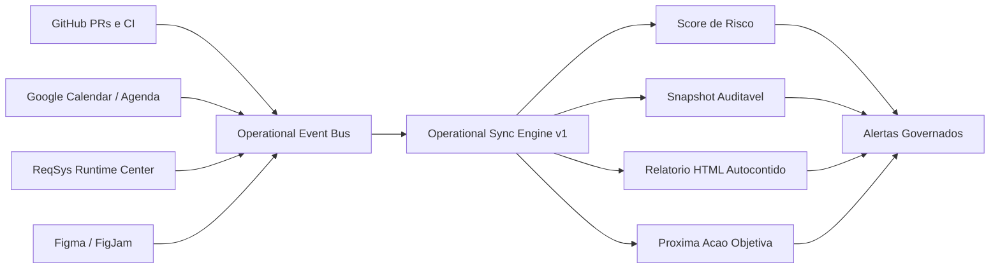

# Operational Sync Engine v1 — Retorno Visual

## FigJam gerado

- URL editável: https://www.figma.com/online-whiteboard/create-diagram/d86af794-d0fa-4767-93c5-0f59d3d91cfc?utm_source=chatgpt&utm_content=edit_in_figjam&oai_id=v1%2Fnesi2ECrBtYtr3PurXfLuOG4R5yfweqajVFFgCbhwbFYjVIzn6m3B6&request_id=f2cdc5dc-e198-44f5-94fc-ba7f2c4434a1
- Expiração da imagem temporária: 2026-06-29T03:41:24Z
- Estado: gerado pelo conector Figma/FigJam e exibido em tela no chat.

## Critérios visuais obrigatórios

- Deve existir retorno navegável no repositório.
- Deve existir fallback `.html` autocontido.
- Deve existir diagrama versionado mesmo quando Figma/FigJam não estiver disponível.
- Deve existir referência explícita no PR.
