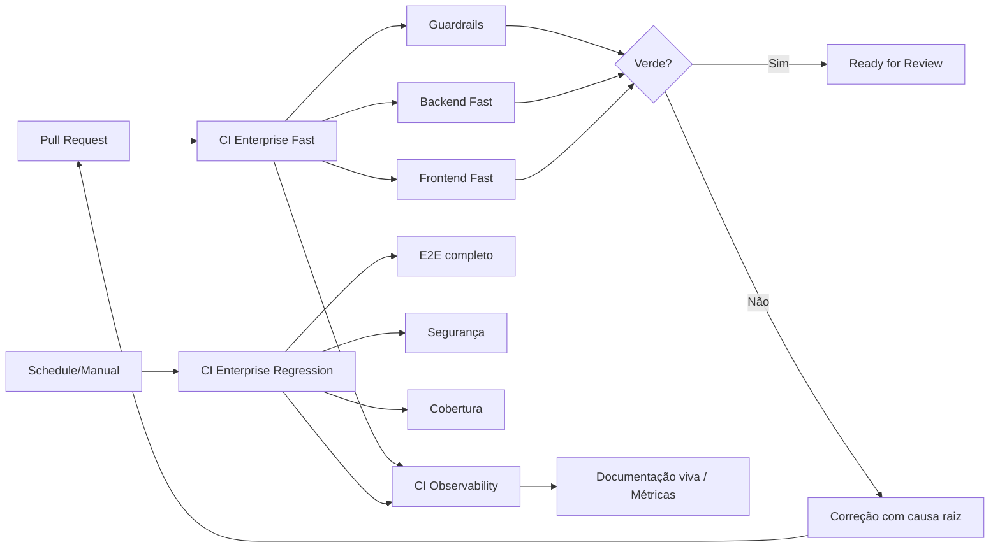

# CI Enterprise Continuous Maturity — ReqSys

## Objetivo

Estabilizar a esteira do ReqSys para que o CI seja rápido, determinístico, auditável e com regressão controlada.

Este documento define o padrão operacional para evitar o ciclo improdutivo de corrigir uma falha pontual, obter verde temporário e voltar a quebrar em seguida.

---

## Problema tratado

| Sintoma | Causa estrutural provável | Correção definitiva |
|---|---|---|
| CI demora muito | Jobs caros no PR, E2E amplo sempre, baixa paralelização | Separar fast path de regressão completa |
| CI verde volta a ficar vermelho | Testes flaky, dependência mutável, ambiente compartilhado | Guardrails, versões fixas, retries controlados e isolamento |
| Rerun resolve erro | Não determinismo | Registrar como flaky e criar teste/guardrail preventivo |
| Deploy falha após merge | Gates insuficientes | Bloqueios de produção e validação pós-merge |
| Falha recorrente sem aprendizado | Falta de documentação viva | ADR + runbook + monitoramento operacional |

---

## Arquitetura de pipeline

---

## Workflows adicionados

| Workflow | Arquivo | Função | Frequência |
|---|---|---|---|
| CI Enterprise Fast | `.github/workflows/ci-enterprise-fast.yml` | Guardrails, backend fast, frontend fast | PR, push main, manual |
| CI Enterprise Regression | `.github/workflows/ci-enterprise-regression.yml` | Full regression, E2E, segurança, cobertura | Diário/manual |
| CI Enterprise Observability | `.github/workflows/ci-enterprise-observability.yml` | Relatórios de maturidade da esteira | Após workflows/manual |

---

## Guardrails implementados

Arquivo: `scripts/ci_enterprise_guardrails.py`

| Regra | Tipo | Motivo |
|---|---|---|
| `CI_DETERMINISM_NODE` | Erro | Bloqueia `node-version: latest` |
| `CI_DETERMINISM_ACTION_REF` | Erro | Bloqueia actions apontando para branch mutável |
| `CI_DETERMINISM_NPM_INSTALL` | Warning | Recomenda `npm ci` quando houver lockfile |
| `CI_GOVERNANCE_CONTINUE_ON_ERROR` | Warning | Evita erro mascarado em gate obrigatório |
| `CI_LOCKFILE_MISSING` | Warning | Evidencia falta de lockfile |
| `SECURITY_AUTH_DISABLED` | Erro | Bloqueia autenticação desligada versionada em runtime/config produtivo |
| `SECURITY_CORS_WILDCARD` | Erro | Bloqueia CORS `*` em runtime/config produtivo |
| `SECURITY_JWT_DISABLED` | Erro | Bloqueia JWT sem validação real em runtime/config produtivo |
| `SECURITY_SECRET_LITERAL` | Erro | Bloqueia segredo literal versionado em runtime/config produtivo |

### Classificação de severidade dos guardrails de segurança

| Contexto | Tratamento |
|---|---|
| Código runtime e configuração produtiva | Erro bloqueante |
| Documentação | Warning |
| Testes, specs, fixtures, mocks e exemplos | Não bloqueante |
| Perfis demo em frontend | Permitidos apenas para e-mail/perfil; senha não pode ser versionada |

---

## Política de flaky tests

Um teste é considerado flaky quando:

- falha e passa em rerun sem alteração de código;
- falha por timeout aleatório;
- depende de horário, rede externa ou ordem de execução;
- depende de massa mutável compartilhada;
- falha em screenshot/DOM de forma intermitente.

### Tratamento obrigatório

| Ação | Obrigatório |
|---|---:|
| Registrar ocorrência | Sim |
| Separar causa raiz | Sim |
| Adicionar retry controlado apenas como mitigação | Sim |
| Corrigir isolamento/determinismo | Sim |
| Criar teste preventivo | Sim |
| Atualizar documentação viva | Sim |

---

## Política de tempo

| Camada | Meta |
|---|---:|
| Guardrails | até 1 min |
| Backend fast | até 5 min |
| Frontend fast | até 5 min |
| PR fast total | até 8 min |
| Regressão completa | nightly/manual |

---

## Indicadores de maturidade

| Indicador | Meta enterprise |
|---|---:|
| Tempo médio do CI fast | <= 8 min |
| Flaky rate | < 2% |
| Taxa de rerun | < 5% |
| Falhas sem causa raiz | 0 |
| Falhas recorrentes sem guardrail | 0 |
| Produção sem gate obrigatório | 0 |

---

## DoD para considerar a esteira madura

- CI fast verde em PR.
- Regressão completa executada no mínimo diariamente.
- Guardrails bloqueando insegurança e não determinismo.
- Relatórios publicados como artifacts.
- Falhas recorrentes convertidas em testes e guardrails.
- Branch protection exigindo checks obrigatórios.
- Merge apenas após revisão, CI verde e validação explícita.

---

## Observação de governança

Status de maturidade não deve ser marcado como “avançado” apenas por documentação ou intenção. O estado atual só pode ser elevado após execução verde, evidência anexada e estabilidade monitorada.
