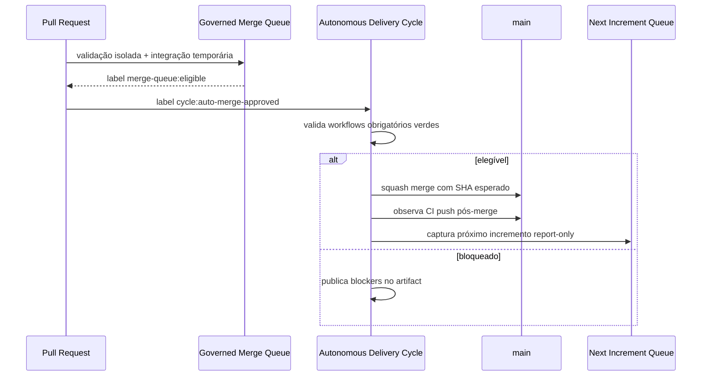

# Fluxo — Autonomous Delivery Cycle

```mermaid
sequenceDiagram
  participant PR as Pull Request
  participant MQ as Governed Merge Queue
  participant ADC as Autonomous Delivery Cycle
  participant Main as main
  participant Queue as Next Increment Queue

  PR->>MQ: validação isolada + integração temporária
  MQ-->>PR: label merge-queue:eligible
  PR->>ADC: label cycle:auto-merge-approved
  ADC->>ADC: valida workflows obrigatórios verdes
  alt elegível
    ADC->>Main: squash merge com SHA esperado
    ADC->>Main: observa CI push pós-merge
    ADC->>Queue: captura próximo incremento report-only
  else bloqueado
    ADC->>ADC: publica blockers no artifact
  end
```
