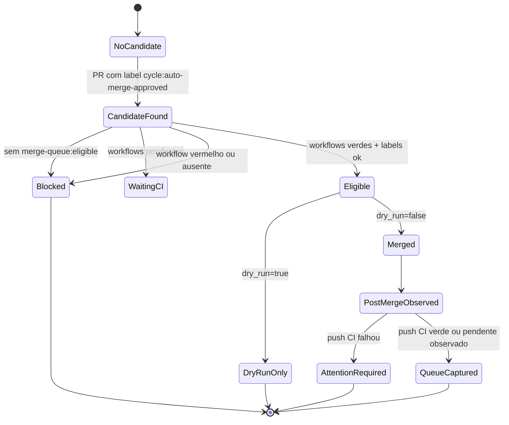

# State machine — Autonomous Delivery Cycle

```mermaid
stateDiagram-v2
  [*] --> NoCandidate
  NoCandidate --> CandidateFound: PR com label cycle:auto-merge-approved
  CandidateFound --> Blocked: sem merge-queue:eligible
  CandidateFound --> WaitingCI: workflows pendentes
  CandidateFound --> Blocked: workflow vermelho ou ausente
  CandidateFound --> Eligible: workflows verdes + labels ok
  Eligible --> DryRunOnly: dry_run=true
  Eligible --> Merged: dry_run=false
  Merged --> PostMergeObserved
  PostMergeObserved --> AttentionRequired: push CI falhou
  PostMergeObserved --> QueueCaptured: push CI verde ou pendente observado
  QueueCaptured --> [*]
  Blocked --> [*]
  DryRunOnly --> [*]
  AttentionRequired --> [*]
```
