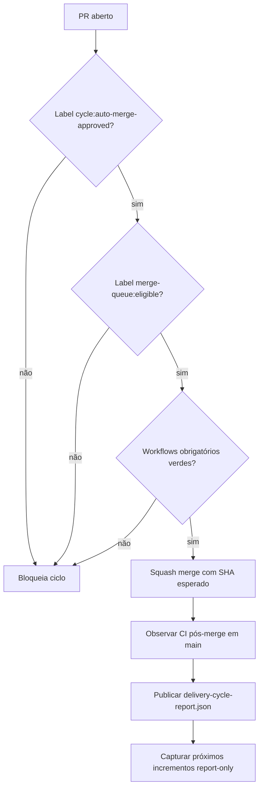

# Autonomous Delivery Cycle — status executivo

| Indicador | Estado alvo |
|---|---|
| Auto-merge governado | Ativo somente com label explícita |
| CI obrigatório | Todos verdes antes do merge |
| Pós-merge | Observação de runs `push` |
| Próximos incrementos | Captura report-only |
| Execução automática de incremento | Não autorizada |
| Risco operacional | Baixo, condicionado aos guardrails |

## Fluxo

## Próxima ação recomendada

Após merge deste incremento, executar o workflow em `dry_run=true`. Se o relatório sair limpo, aplicar a label `cycle:auto-merge-approved` apenas nos PRs pequenos, verdes e de baixo risco.
