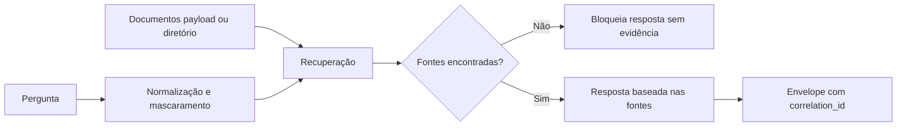

# RAG Python Governado com LlamaIndex

## Estado evidenciado

| Item | Status | Evidência |
|---|---:|---|
| API FastAPI | 🟢 Implementada | `POST /api/rag/perguntas` e `GET /api/rag/health` |
| Fonte obrigatória | 🟢 Implementada | Sem fonte recuperada, a resposta é bloqueada |
| Auditoria | 🟢 Implementada | `correlation_id` propagado no envelope padrão |
| PII básica | 🟢 Implementada | CPF/e-mail mascarados antes da resposta |
| LlamaIndex | 🟡 Preparado | Detecção de disponibilidade e fallback offline |
| Vector store externo | 🔵 Alvo | Próximo incremento: Qdrant ou pgvector |

## Fluxo operacional



## Endpoint

```http
POST /api/rag/perguntas
Content-Type: application/json
X-Correlation-Id: rag-manual-001
```

```json
{
  "pergunta": "Como o RAG corporativo deve responder?",
  "top_k": 4,
  "documentos": [
    {
      "id": "gov-001",
      "titulo": "Governança RAG",
      "conteudo": "RAG corporativo deve responder com fontes, correlation_id, auditoria e bloqueio sem evidencia.",
      "origem": "runbook"
    }
  ]
}
```

## Execução local

```bash
cd backend
pip install -r requirements.txt
pytest tests/test_rag_governado.py -q
uvicorn app.main:app --reload
```

## Configurações

| Variável | Finalidade | Padrão |
|---|---|---|
| `REQSYS_RAG_DOCUMENTS_PATH` | Diretório com `.md`/`.txt` para consulta quando o payload não enviar documentos | vazio |
| `REQSYS_RAG_VECTOR_STORE` | Estratégia alvo de armazenamento vetorial | `in_memory` |
| `REQSYS_RAG_REQUIRE_SOURCES` | Exigir fonte para responder | `true` |

## Próximo incremento recomendado

1. Adicionar dependências opcionais de LlamaIndex em arquivo separado `requirements-rag.txt`.
2. Criar adapter `QdrantVectorStoreAdapter` ou `PgVectorStoreAdapter`.
3. Persistir chunks com `document_id`, `chunk_id`, `hash`, `score`, `origem`, `versao_indice` e `indexed_at`.
4. Expor painel frontend com drill-down de fontes e trechos recuperados.
5. Adicionar gate de produção: bloquear resposta RAG sem fonte e sem `correlation_id`.
