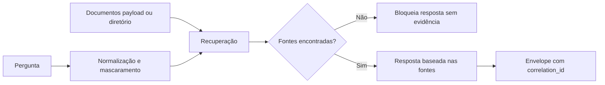

# RAG Python Governado

## Estado evidenciado

| Item | Status | Evidência |
|---|---:|---|
| API FastAPI | 🟢 Implementada | `POST /api/rag/perguntas` e `GET /api/rag/health` |
| Fonte obrigatória | 🟢 Implementada | Sem fonte recuperada, a resposta é bloqueada |
| Auditoria | 🟢 Implementada | `correlation_id` propagado no envelope padrão |
| PII básica | 🟢 Implementada | CPF/e-mail mascarados antes da resposta |
| Recuperação/embeddings próprios | 🟢 Implementada | Mecanismo local e persistido sem dependência de LlamaIndex |
| LlamaIndex | 🔴 Suspenso por segurança | Removido de `requirements-rag.txt` enquanto NLTK estiver afetado por PYSEC-2026-3740 / CVE-2026-81726 |
| Vector store externo | 🔵 Alvo | Próximo incremento: Qdrant ou pgvector |

## Decisão temporária de segurança

A implementação atual do ReqSys não importa LlamaIndex. A dependência opcional `llama-index-core` introduzia `nltk` de forma transitiva, e versões do NLTK até 3.10.3 estão afetadas por PYSEC-2026-3740 / CVE-2026-81726.

Enquanto não existir versão corrigida upstream:

- LlamaIndex não deve ser instalado nos ambientes do ReqSys;
- `requirements-rag.txt` mantém apenas dependências opcionais que não introduzem essa cadeia vulnerável;
- o RAG atual continua usando o mecanismo próprio já existente;
- LlamaIndex só poderá ser reintroduzido após versão corrigida, testes e scanner de dependências aprovados.

## Fluxo operacional


```mermaid
flowchart LR
    A[Pergunta] --> B[Normalização e mascaramento]
    C[Documentos payload ou diretório] --> D[Recuperação]
    B --> D
    D --> E{Fontes encontradas?}
    E -- Não --> F[Bloqueia resposta sem evidência]
    E -- Sim --> G[Resposta baseada nas fontes]
    G --> H[Envelope com correlation_id]
```

## Endpoint

```http
POST /api/rag/perguntas
Content-Type: application/json
X-Correlation-Id: rag-manual-001
```

```json
{
  "pergunta": "Como o RAG corporativo deve responder?",
  "top_k": 4,
  "documentos": [
    {
      "id": "gov-001",
      "titulo": "Governança RAG",
      "conteudo": "RAG corporativo deve responder com fontes, correlation_id, auditoria e bloqueio sem evidencia.",
      "origem": "runbook"
    }
  ]
}
```

## Execução local

```bash
cd backend
pip install -r requirements.txt
pytest tests/test_rag_governado.py -q
uvicorn app.main:app --reload
```

## Configurações

| Variável | Finalidade | Padrão |
|---|---|---|
| `REQSYS_RAG_DOCUMENTS_PATH` | Diretório com `.md`/`.txt` para consulta quando o payload não enviar documentos | vazio |
| `REQSYS_RAG_VECTOR_STORE` | Estratégia de armazenamento vetorial | `in_memory` |
| `REQSYS_RAG_REQUIRE_SOURCES` | Exigir fonte para responder | `true` |

## Próximo incremento recomendado

1. Manter LlamaIndex suspenso até existir versão corrigida do NLTK.
2. Implementar integração direta com Qdrant ou pgvector somente quando necessária, sem reintroduzir dependências não utilizadas.
3. Persistir chunks com `document_id`, `chunk_id`, `hash`, `score`, `origem`, `versao_indice` e `indexed_at`.
4. Expor painel frontend com detalhamento de fontes e trechos recuperados.
5. Manter gate de produção bloqueando resposta RAG sem fonte e sem `correlation_id`.
