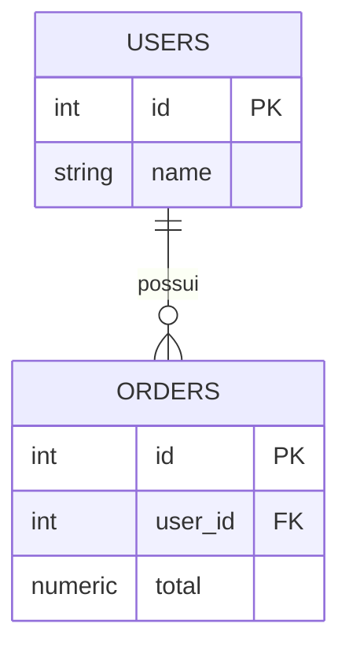

# SQL Visual Explain Stack

## Objetivo

Aplicar duas frentes complementares para estudo, análise e governança de SQL:

1. **Fluxo didático:** actuallyEXPLAIN + IA + DBeaver/pgAdmin.
2. **Fluxo enterprise:** DBeaver/DataGrip + EXPLAIN ANALYZE + SQLGlot + documentação Mermaid/ERD versionada.

Este documento segue o padrão operacional: **Contexto → Missão → Análise → Query → Resultado**.

---

## 1. Fluxo didático

### Contexto

Consulta base analisada:

```sql
SELECT
  u.id,
  u.name,
  o.total
FROM users u
JOIN orders o ON o.user_id = u.id
WHERE o.total > 100
ORDER BY o.total DESC;
```

### Missão

Identificar usuários com pedidos acima de 100, exibindo usuário, nome e total do pedido, ordenando pelos maiores valores.

### Análise lógica

| Etapa | Elemento SQL | Interpretação |
|---|---|---|
| Fonte principal | `users u` | Entidade de clientes/usuários |
| Relacionamento | `orders o ON o.user_id = u.id` | Junta pedidos ao usuário dono do pedido |
| Filtro | `o.total > 100` | Mantém apenas pedidos relevantes por valor |
| Projeção | `u.id`, `u.name`, `o.total` | Exibe identificação e valor do pedido |
| Ordenação | `ORDER BY o.total DESC` | Lista maiores pedidos primeiro |

### Uso recomendado

| Ferramenta | Aplicação |
|---|---|
| actuallyEXPLAIN | Visualizar intenção lógica da consulta |
| ChatGPT/Claude | Explicar regras, lacunas, riscos e alternativas |
| DBeaver/pgAdmin | Executar SQL, validar resultado e inspecionar schema |

---

## 2. Fluxo enterprise

### Stack recomendada

| Camada | Ferramenta | Finalidade |
|---|---|---|
| IDE SQL | DBeaver ou DataGrip | Execução, histórico, explain e inspeção |
| Banco | PostgreSQL | `EXPLAIN`, `EXPLAIN ANALYZE`, índices e estatísticas |
| Parser | SQLGlot | AST, linhagem, tabelas, colunas e dialetos SQL |
| Documentação | Mermaid/ERD | Relações versionadas no Git |
| Governança | CI/CD | Validar scripts, documentação e padrões |

### Critérios mínimos de governança

- Toda query relevante deve ter objetivo de negócio documentado.
- Toda query analítica deve declarar tabelas, joins, filtros e métricas.
- Toda query crítica deve ter `EXPLAIN ANALYZE` salvo ou resumido.
- Toda relação relevante deve ter ERD ou diagrama Mermaid versionado.
- Toda evolução deve preservar rastreabilidade em Git.

---

## 3. Consultas aplicáveis ao exemplo

### 3.1 Total gasto por usuário

```sql
SELECT
  u.id,
  u.name,
  SUM(o.total) AS total_gasto
FROM users u
JOIN orders o ON o.user_id = u.id
GROUP BY u.id, u.name
ORDER BY total_gasto DESC;
```

### 3.2 Quantidade de pedidos por usuário

```sql
SELECT
  u.id,
  u.name,
  COUNT(o.id) AS quantidade_pedidos
FROM users u
JOIN orders o ON o.user_id = u.id
GROUP BY u.id, u.name
ORDER BY quantidade_pedidos DESC;
```

### 3.3 Ticket médio por usuário

```sql
SELECT
  u.id,
  u.name,
  AVG(o.total) AS ticket_medio
FROM users u
JOIN orders o ON o.user_id = u.id
GROUP BY u.id, u.name
ORDER BY ticket_medio DESC;
```

### 3.4 Usuários sem pedidos

```sql
SELECT
  u.id,
  u.name
FROM users u
LEFT JOIN orders o ON o.user_id = u.id
WHERE o.id IS NULL;
```

### 3.5 Pedidos acima da média geral

```sql
SELECT
  u.id,
  u.name,
  o.total
FROM users u
JOIN orders o ON o.user_id = u.id
WHERE o.total > (
  SELECT AVG(total)
  FROM orders
)
ORDER BY o.total DESC;
```

### 3.6 Ranking dos maiores pedidos por usuário

```sql
SELECT
  u.id,
  u.name,
  o.total,
  ROW_NUMBER() OVER (
    PARTITION BY u.id
    ORDER BY o.total DESC
  ) AS ranking_pedido
FROM users u
JOIN orders o ON o.user_id = u.id;
```

### 3.7 Maior pedido de cada usuário

```sql
SELECT
  id,
  name,
  total
FROM (
  SELECT
    u.id,
    u.name,
    o.total,
    ROW_NUMBER() OVER (
      PARTITION BY u.id
      ORDER BY o.total DESC
    ) AS rn
  FROM users u
  JOIN orders o ON o.user_id = u.id
) x
WHERE rn = 1
ORDER BY total DESC;
```

---

## 4. Diagrama lógico Mermaid



---

## 5. Próximo incremento recomendado

Implementar um utilitário versionado para:

1. Receber uma query SQL.
2. Extrair tabelas, joins, colunas e filtros via SQLGlot.
3. Gerar Markdown com intenção lógica.
4. Gerar Mermaid ERD ou fluxo lógico.
5. Opcionalmente executar `EXPLAIN`/`EXPLAIN ANALYZE` em ambiente controlado.

Status atual: **documentação operacional aplicada**.

Status alvo: **SQL Query Intelligence integrado ao runtime/documentação viva**.
