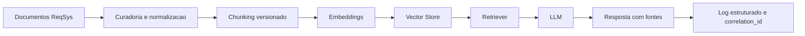

# Aplicacoes no ReqSys

## Objetivo

Registrar como os temas da trilha de IA e Machine Learning podem ser convertidos em capacidades praticas para o ecossistema ReqSys.

## Mapa de aplicacao

| Tema | Aplicacao recomendada no ReqSys | Valor esperado |
|---|---|---|
| Machine Learning classico | Classificacao de requisitos, riscos e prioridades | Apoio a triagem e priorizacao |
| Metricas de classificacao | Avaliar classificadores com precisao, recall e F1 | Governanca de qualidade |
| Deteccao de anomalias | Identificar requisitos fora do padrao, gaps e desvios | Controle operacional |
| XAI | Explicar classificacoes e scores | Auditoria e confianca |
| NLP | Extrair entidades, intencoes, atores, regras e criterios | Engenharia de requisitos assistida |
| LLMs | Refinar, sumarizar e gerar criterios BDD | Produtividade assistida |
| RAG | Consultar documentacao viva, ADRs, requisitos e changelogs | Respostas fundamentadas |
| Agentes | Especializacao por PO, QA, Arquitetura e Governanca | Orquestracao controlada |
| Busca e otimizacao | Sugerir priorizacao e sequenciamento de backlog | Melhor uso de capacidade |
| Logica difusa | Scoring aproximado de maturidade, criticidade e confianca | Decisao gradual e interpretavel |

## Arquitetura recomendada para RAG no ReqSys

## Regras de governanca

- Toda resposta RAG deve informar fontes e versao do material consultado.
- Toda execucao assistida deve registrar `correlation_id`.
- Saidas de IA devem separar fato, inferencia e recomendacao.
- Classificadores devem possuir metrica principal, matriz de confusao e baseline.
- O projeto deve preservar LGPD: sem PII em logs, exemplos ou datasets publicos.

## Backlog recomendado

| Prioridade | Item | Resultado esperado |
|---:|---|---|
| P0 | Indice RAG de documentacao ReqSys | Consulta fundamentada a arquitetura viva |
| P1 | Classificador de requisitos | Tipo, prioridade, ambiguidade e risco |
| P1 | Validador BDD | Criterios Given/When/Then avaliados por qualidade |
| P1 | Detector de anomalias em requisitos | Gaps, duplicidade, inconsistencia e outliers |
| P2 | XAI para classificacao | Explicacao auditavel das decisoes |
| P2 | Dashboard de metricas dos agentes | Qualidade, confianca, cobertura e drift |

## Decisao recomendada

O primeiro incremento produtivo deve ser um RAG governado e consultivo sobre documentacao viva do ReqSys, com rastreabilidade, metricas e revisao antes de evoluir capacidades operacionais.
