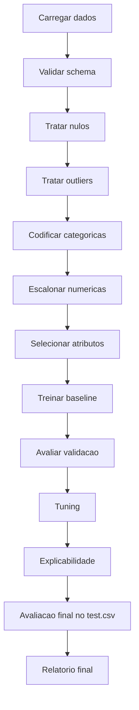

# Projeto Final — Adult Income Dataset

## Objetivo

Construir um modelo de Machine Learning para prever a classe de renda do Adult Income Dataset, com foco em melhor performance medida por F1 Score.

## Premissas

| Item | Definicao |
|---|---|
| Dataset | Adult Income |
| Classe alvo | Income: `<=50K` ou `>50K` |
| Metrica principal | F1 Score |
| Treino | `train.csv` |
| Validacao | `validation.csv` |
| Teste final | `test.csv` |
| Uso do teste | Somente avaliacao final |

## Pipeline recomendado

## Modelos candidatos

| Ordem | Modelo | Uso |
|---:|---|---|
| 1 | DummyClassifier | Baseline minimo |
| 2 | LogisticRegression | Baseline interpretavel |
| 3 | RandomForestClassifier | Modelo robusto inicial |
| 4 | GradientBoosting ou HistGradientBoosting | Performance tabular |
| 5 | XGBoost ou LightGBM | Opcional, se permitido no ambiente |

## Tabela de experimentos

| Experimento | Alteracao | F1 validacao | Precision | Recall | Observacao |
|---|---|---:|---:|---:|---|
| E00 | Baseline dummy | TBD | TBD | TBD | Referencia minima |
| E01 | Regressao logistica | TBD | TBD | TBD | Interpretavel |
| E02 | Encoding + scaler | TBD | TBD | TBD | Pipeline completo |
| E03 | Feature selection | TBD | TBD | TBD | Reducao de ruido |
| E04 | Tuning | TBD | TBD | TBD | Melhor modelo candidato |
| E05 | XAI | TBD | TBD | TBD | Explicacao final |
| E06 | Teste final | TBD | TBD | TBD | Resultado final congelado |

## Criterios de aceite

- Dataset carregado com schema validado.
- `test.csv` usado apenas no encerramento.
- Pipeline reprodutivel com seed fixa.
- F1 Score reportado como metrica principal.
- Matriz de confusao gerada.
- Precision, recall e acuracia reportados como metricas secundarias.
- Hipoteses e mudancas registradas por experimento.
- Explicabilidade aplicada ao melhor modelo.
- Relatorio final publicado em Markdown.

## Riscos

| Risco | Mitigacao |
|---|---|
| Data leakage | Separar treino, validacao e teste desde o inicio |
| Overfitting | Comparar treino e validacao, usar cross-validation quando aplicavel |
| Classe desbalanceada | Usar F1, precision, recall e matriz de confusao |
| Pipeline nao reprodutivel | Fixar seed, dependencias e versoes |
| Resultado sem explicabilidade | Adicionar feature importance ou SHAP |

## Proximo incremento tecnico

Criar `notebooks/04_projeto_final_adult_income.ipynb` e `src/` com pipeline de pre-processamento, treino, avaliacao e relatorio de metricas.
