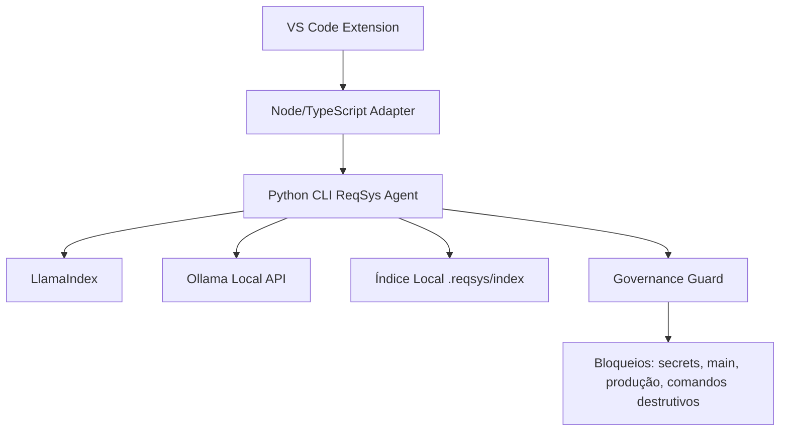

# ReqSys VS Code Local RAG Agent

Extensão VS Code + agente local Python para análise governada do projeto ReqSys usando RAG local com LlamaIndex e runtime Ollama/llama.cpp.

## Estado

| Item | Estado |
|---|---|
| Extensão VS Code | Implementada |
| Agente Python CLI | Implementado |
| RAG local somente leitura | Implementado |
| Governança de segurança | Implementada |
| WebView operacional | Implementada |
| Testes base | Implementados |
| CI de validação | Implementado |
| Aplicação automática de patch | Bloqueada por padrão |

## Objetivo

Permitir que o usuário use o ReqSys como assistente local no VS Code para:

- indexar o workspace;
- consultar o projeto com RAG;
- gerar checklist de governança;
- analisar logs locais de CI;
- sugerir correções sem aplicar automaticamente;
- preservar segurança, rastreabilidade e revisão humana.

## Arquitetura



## Instalação local

### 1. Agente Python

```bash
cd tools/reqsys-vscode-local-rag-agent/agent
python -m venv .venv
source .venv/bin/activate  # Linux/macOS
# .venv\Scripts\activate   # Windows
pip install -r requirements.txt
python -m reqsys_agent.cli health
```

### 2. Ollama

```bash
ollama pull qwen2.5:7b
ollama pull nomic-embed-text
```

### 3. Extensão VS Code

```bash
cd tools/reqsys-vscode-local-rag-agent/extension
npm install
npm run compile
npm run package
```

Instalar o `.vsix` gerado:

```bash
code --install-extension reqsys-vscode-local-rag-agent-0.1.0.vsix
```

## Comandos VS Code

- `ReqSys: Abrir Painel Operacional`
- `ReqSys: Indexar Projeto`
- `ReqSys: Perguntar ao Projeto`
- `ReqSys: Gerar Checklist Padrão Ouro`
- `ReqSys: Analisar CI Local`

## O que não pode fazer

| Bloqueio | Motivo |
|---|---|
| Aplicar patch automaticamente | revisão humana obrigatória |
| Alterar `main` diretamente | branch protection/governança |
| Ler `.env`, secrets, tokens ou chaves | LGPD/segurança |
| Executar comandos destrutivos | prevenção de dano operacional |
| Enviar código para LLM externo | privacidade e controle de dados |
| Declarar CI verde sem evidência | rastreabilidade obrigatória |
| Corrigir produção automaticamente | risco operacional |

## Variáveis de ambiente

| Variável | Padrão | Descrição |
|---|---|---|
| `REQSYS_AGENT_MODEL` | `qwen2.5:7b` | Modelo local Ollama |
| `REQSYS_EMBED_MODEL` | `nomic-embed-text` | Modelo de embeddings |
| `REQSYS_OLLAMA_BASE_URL` | `http://localhost:11434` | URL local Ollama |
| `REQSYS_SAFE_MODE` | `true` | Mantém ações destrutivas bloqueadas |

## Validação

```bash
PYTHONPATH=tools/reqsys-vscode-local-rag-agent/agent pytest tools/reqsys-vscode-local-rag-agent/agent/tests -q
cd tools/reqsys-vscode-local-rag-agent/extension && npm test
```

## Decisão operacional

Este pacote deve entrar em PR como **draft** primeiro. O merge só deve ocorrer com:

- CI verde;
- sem conflitos;
- revisão humana;
- checklist de segurança validado;
- evidência de execução local do `health`, `index` e `ask`.
