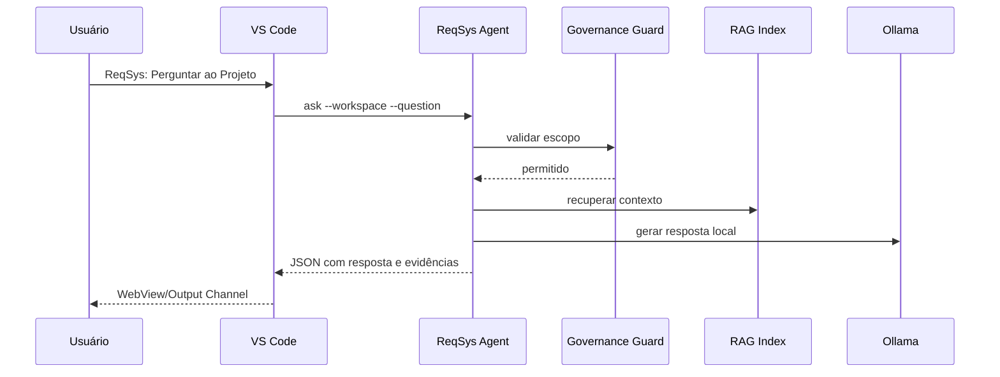

# Arquitetura — ReqSys VS Code Local RAG Agent

## Decisão

Criar uma extensão VS Code com adapter TypeScript e agente Python local. A extensão não executa IA diretamente; ela chama um CLI local versionado.

## Componentes

| Componente | Responsabilidade |
|---|---|
| VS Code Extension | UX, comandos, WebView, seleção de workspace |
| Agent CLI | execução governada, RAG, análise e saída JSON |
| LlamaIndex | indexação, retrieval e consulta |
| Ollama | inferência local |
| Governance Guard | bloqueio de arquivos sensíveis e ações proibidas |
| `.reqsys/index` | índice local não versionável |

## Fluxo de consulta

## Estados

| Estado | Significado |
|---|---|
| Verde | validado localmente |
| Amarelo | depende de ambiente/modelo local |
| Vermelho | bloqueado por governança |

## Restrições

- Sem escrita automática em arquivos do projeto no MVP.
- Sem execução remota.
- Sem envio de conteúdo para provedores externos.
- Sem leitura de secrets.
- Sem alteração direta em branch protegida.

## Evolução recomendada

1. MVP somente leitura.
2. Sugestão de patch com diff.
3. Aplicação assistida com confirmação.
4. Integração GitHub Actions.
5. Dashboard operacional vivo.
